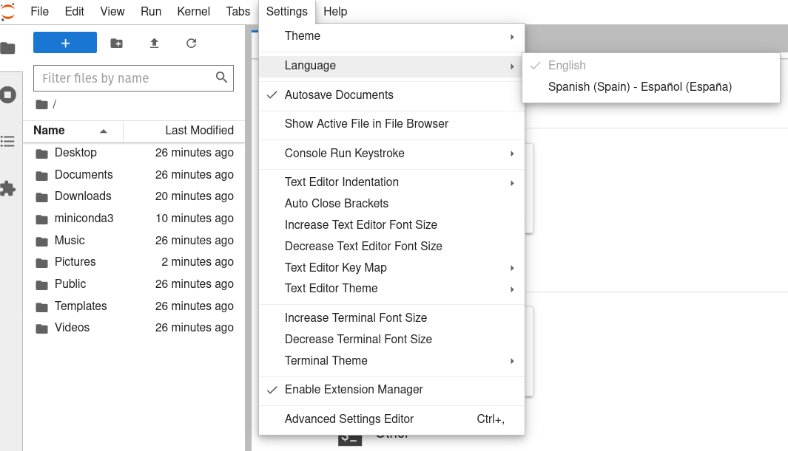
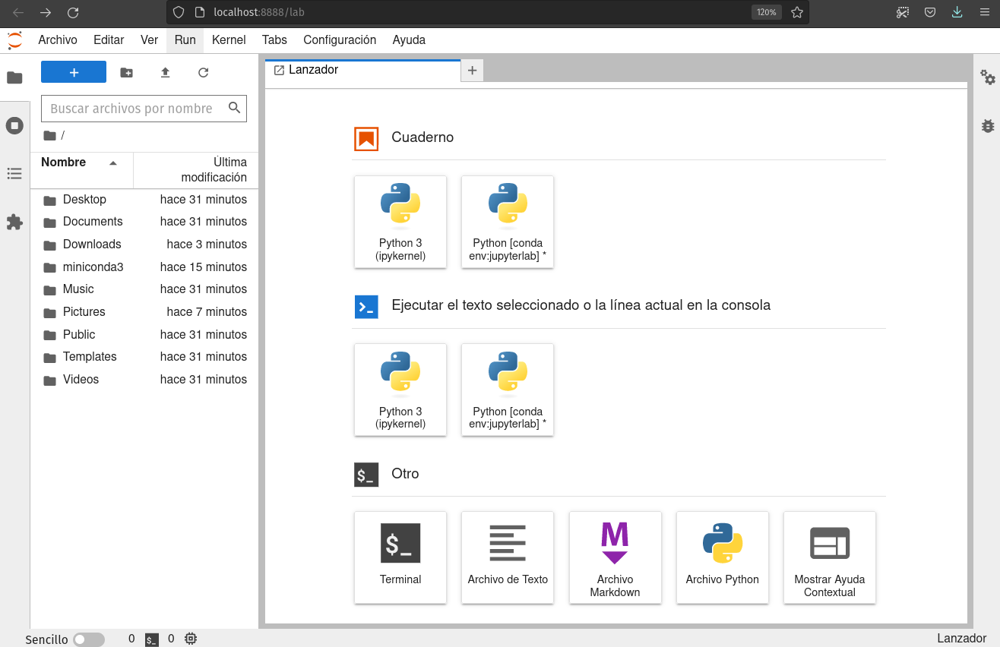
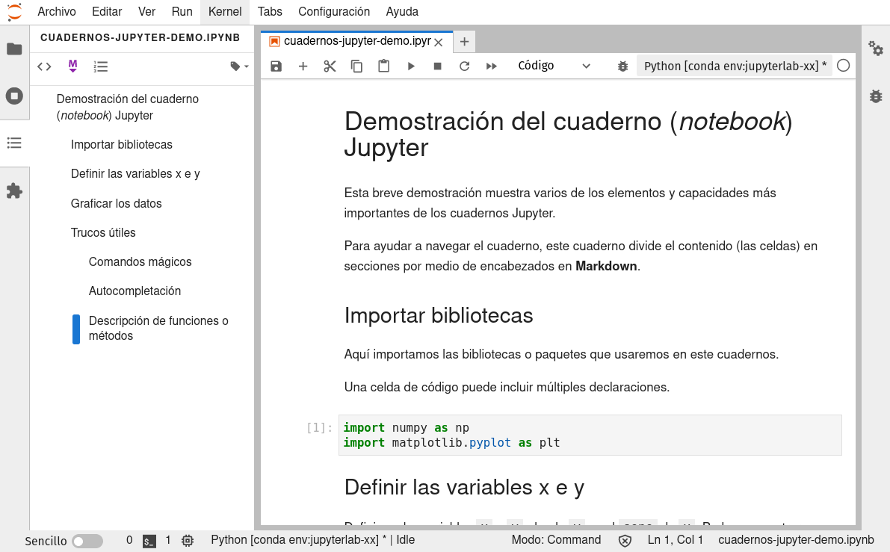
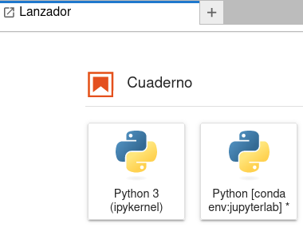
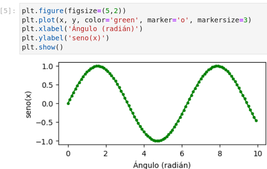
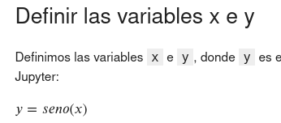

<p align="left">
<strong><a href="../Indice.html">Indice</a></strong>
|
<strong><a href="../Intro a R/R.html">R</a></strong>
|
<strong><a href="../Intro a Python/Python.html">Python</a></strong>
|
<strong><a href="../Intro a Jupyter/Jupyter.html">Jupyter</a></strong>
|
<strong><a href="../Intro a github/Github.html">Github</a></strong>
|
<strong><a href="../enlaces.html">Enlaces</a></strong>
</p>


# Introducción a Jupyter

## ¿Qué es Jupyter?

[Jupyter](https://es.wikipedia.org/wiki/Proyecto_Jupyter) es un ecosistema abierto (*open source*) de computación desarrollado por el [Proyecto Jupyter](https://jupyter.org/) que incluye herramientas para el desarrollo, intercambio y presentación interactiva de código y proyectos de análisis de datos, con apoyo para una gran cantidad de lenguajes de programación (su nombre se deriva de los lenguajes de código abierto Julia, Python y R). 

El ecosistema del Proyecto Jupyter está [compuesto de tres elementos](https://jupyter4edu.github.io/jupyter-edu-book/why-we-use-jupyter-notebooks.html#but-first-what-is-jupyter-notebook): una colección de estándares, una comunidad y una serie de herramientas de software. [JupyterLab](https://jupyterlab.readthedocs.io/en/stable/) es una aplicación para crear, manejar y correr cuadernos (*notebooks*) Jupyter. Un [cuaderno Jupyter](https://es.wikipedia.org/wiki/Proyecto_Jupyter#Jupyter_Notebook) es un documento que permite mezclar código ejecutable, ecuaciones, visualizaciones y texto narrativo formateado. Un cuaderno puede combinar en un sólo documento el código, los datos que utiliza y sus resultados, incluyendo explicaciones, gráficas y contenido multimedia, de tal modo que pueda ser compartido ampliamente y corrido por otros con relativa facilidad. El cuaderno permite la creación de narrativas computacionales interactivas y reproducibles.

El ecosistema Jupyter utiliza tecnología web que permite correr las apliaciones en un navegador (*browser*) web con las computaciones ya sea en tu propia computadora ("local") o a través de servicios o servidores remotos, incluyendo en la nube. Los cuadernos Jupyter y el ecosistema Jupyter hoy en día gozan de una gran popularidad en aplicaciones de ciencias de datos y aplicaciones científicas en general, especialmente con el lenguaje Python.

## JupyterLab: Instalación y lanzamiento

### Instalar JupyterLab

Instalaremos la aplicación `JupyterLab` en tu computadora, utilizando el sistema `conda`. Encontrarás instrucciones detalladas en [nuestra página de instalación de JupyterLab y conda.](instalacion-jlab-conda.md)

### Lanzar JupyterLab

La aplicación `JupyterLab` es lanzada desde la **terminal** (*shell*). En la terminal, primero cambia de carpeta hacia tu carpeta de inicio (*home folder*), o la carpeta que contiene los archivos que quieras utilizar. Luego activa el entorno "jupyterlab" recién creado (este ejemplo es en Windows):

```
cd C:\Users\MIPERFIL
conda activate jupyterlab
```

Ahora lanzamos la aplicación con este comando:

```bash
jupyter lab
```

`JupyterLab` se abrirá automáticamente en tu navegador de defecto. Si no es así, o si deseas utilizar un navegador diferente, abre este enlace local: `http://localhost:8888/lab`

## Interfaz de JupyterLab

### Cambiar el interfaz al español

El entorno que creamos permite cambiar el interfaz de JupyterLab al español. Para hacer este cambio, en el menú de `Settings` selecciona el submenú `Language`, y ahí selecciona Español:



Se abrirá una ventana de confirmación del cambio:


Al confirmarlo presionando `Change and reload`, el navegador se refrescará y verás el interfaz traducido al español. Ojo: ¡la traducción no es 100% completa!

### Tour del interfaz

Aunque JupyterLab tiene muchas características de un Entorno de Desarrollo Integrado (*IDE*) tradicional, su enfoque es en proveer una experiencia computacional interactiva y exploratoria.



El interfaz de JupyterLab consiste de un **área principal de trabajo** que contiene pestañas (*tabs*) de documentos y herramientas, una **barra lateral izquierda**, una **barra de menú**, y una **barra de información** en la parter inferior. La barra lateral izquierda contiene el **navegador de archivos**, la lista de **núcleos (*kernels*), terminales y pestañas (*tabs*) activas**, la **tabla de contenido** para el documento activo, y el **administrador de extensiones**. En el área de trabajo pueden existir varios documentos o componentes abiertos en diferentes pestañas. Estos pueden incluir cuadernos, consolas de Python (similar a una terminal), terminales, y documentos de multimedia. El **lanzador** permite lanzar cuadernos nuevos (seleccionando el núcleo deseado), consolas, terminales, y otros tipos de archivos o herramientas. El menú `Ver > Activar paleta de comandos` da acceso a la **paleta de comandos**.

La documentación de JupyterLab contiene [más detalles sobre el interfaz](https://jupyterlab.readthedocs.io/en/stable/user/interface.html), en inglés.

## Cuadernos (*notebooks*) Jupyter

**El [Cuaderno Jupyter de demostración](cuadernos-jupyter-demo) muestra varios de los elementos y capacidades más importantes de los cuadernos Jupyter.** Puedés bajar el archivo del cuaderno (documento `.ipynb`) [aquí](cuadernos-jupyter-demo.ipynb), para ejecutarlo en tu computadora. Esta imagen muestra un avance del cuaderno:




En JupyterLab puedes abrir un cuaderno ya existente desde el navegador de archivos, en la barra lateral. Para **crear un cuaderno nuevo**, presiona uno de los "núcleos" en el **Lanzador** listados en el área principal de trabajo, bajo "Cuaderno":



### Celdas

El componente principal de un cuaderno es la **celda** (*cell*). Hay dos tipos principales de celdas: **celda de código** y **celda de Markdown**. Para ambos tipos, **al interactuar con celdas existen dos modos de ejecución**: El modo **edición** permite modificar el contenido de las celdas, y el modo **comando** permite ejecutar celdas o modificar el documento. Para entrar al modo edición, presiona la tecla `Enter` o haz clic en una celda seleccionada. Para entrar al modo comando, presiona `Esc` o haz clic fuera de la celda que tengamos seleccionada. Una vez en el modo comando, podemos ejecutar la celda desde la barra de herramientas del cuaderno, presionando `Shift + Enter`, o desde el menú bajo "Run". 

La ejecución de celdas es lineal, de tal modo que el estado actual depende de secuencia exacta de celda de código que has ejecutado. En un cuaderno cuyas celdas han sido ejecutadas en orden estricto, de arriba a abajo, los números de las celdas irán en secuencia consecutiva.  Si has ejecutado las celdas fuera de orden, el estado puede ser confuso. **Para evitar problemas, es importante correr un cuaderno completo, desde el principio (reiniciar y re-ejecutar) hasta el final, luego de haber explorado celdas fuera de secuencia**.

El código en una **celda de código** puede producir resultados visibles al ser ejecutado, que son mostrados debajo de la celda. Por ejemplo, esta celda produce una gráfica:



#### Celdas Markdown

La celda de [Markdown](https://tutorialmarkdown.com/markdown) permite escribir texto formateado o incluir enlaces, listas, encabezados de secciones, tablas, ecuaciones, imágenes u otro contenido multimedia. Markdown es un lenguage de marcado en texto plano fácil de aprender. Es como una versión mucho más sencilla de HTML. En Markdown agregas símbolos de su sintaxis para indicar el tipo de formateo o elementos a incluir. Por ejemplo, rodeando el texto con dos caracteres estrellas lo formatea en negrilla: `**negrilla**` produce **negrilla**. Símbolos numerales al comienza de una línea la convierten en encabezado: `# encabazado de primer nivel`, `## encabazado de segundo nivel`, etc. Este es un ejemplo de una celda Markdown:



Pare aprender más sobre Markdown, [aquí](https://datosgobar.github.io/portal-andino/markdown-guide/) puedes encontrar una guía breve pero completa. [Este Tutorial Markdown](https://tutorialmarkdown.com/markdown) incluye más explicaciones y ejemplos. Ahí también econtrarás un [editor en línea](https://editormarkdown.com/) donde puedes practicar escribir con códigos Markdown y ver los resultados inmediatamente.

### Barra de herramientas de un cuaderno

Un cuaderno incluye una barra de herramientas. Aquí presentamos las principales herramientas. Estas herramientas también pueden ser ejecutadas desde el menú o a través de atajos de teclado.

Herramientas para crear, copiar, o remover celdas:


Herramientas para cambiar el "modo" de ejecución de la celda activa:


Herramientas para ejecutar celdas o el cuaderno entero, o detener la ejecución:


## Trucos útiles

Para hacer el trabajo con un cuaderno Jupyter más eficiente, recomendamos explorar varios "trucos" o atajos comunes. Esto incluyen:

- Atajos de teclado
- Uso de autocompletado y descripción de funciones en ventanas desplegables
- "Comandos mágicos"

El artículo [5 trucos para Jupyter Notebook que no debes perderte](https://elmundodelosdatos.com/5-trucos-para-jupyter-notebook/) contiene una introducción excelente a estos y otros trucos! [Este otro artículo](https://codigofacilito.com/articulos/comandos-ipython) profundiza más sobre los comandos mágicos (nota: `IPython` es una consola interactiva de Python que comparte la implementación de celdas y los comandos mágicos con los cuadernos Jupyter).


## Referencias y recursos

- [Tutorial de Python con Jupyter Notebook](http://facundoq.github.io/courses/images/res/02_python.html). Repasa Python en el contexto de un cuaderno Jupyter.
- Para una breve introducción a cuadernos Jupyter (aunque un poco vieja), consulta [“Introducción a Jupyter Notebooks”](https://datacarpentry.org/python-ecology-lesson-es/jupyter_notebooks/index.html), de [The Carpentries](https://carpentries.org).
- Para más información sobre el uso de la **terminal** (*shell*) en macOS y Linux, te recomendamos el tutorial [La Terminal de Unix](https://swcarpentry.github.io/shell-novice-es/), de [The Carpentries](https://carpentries.org). La terminal PowerShell en Windows se comporta de manera similar.
- Parte de este contenido está basado en el cuaderno `getting-started-guide_-_UW-JupyterHub-for-teaching.ipynb` del contenido de ["JupyterHub for Teaching" de la oficina IT, Universidad de Washington](https://itconnect.uw.edu/tools-services-support/teaching-learning/jupyterhub-for-teaching/quickstart-tutorial/).

### En inglés

- Excelentes tutoriales sobre [JupyterLab](https://foundations.projectpythia.org/foundations/jupyterlab.html) y [Python en Jupyter](https://foundations.projectpythia.org/foundations/jupyter.html), de [Project Pythia](https://projectpythia.org/).
