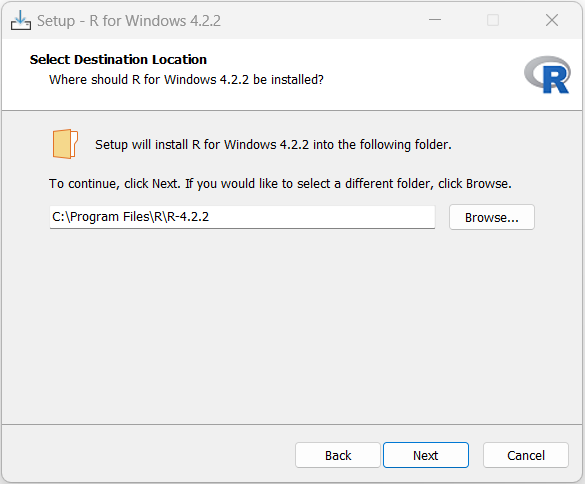

<p align="left">
<strong><a href="../Indice.md">Indice</a></strong>
|
<strong><a href="../Intro a R/R.md">R</a></strong>
|
<strong><a href="../Intro a Python/Python.md">Python</a></strong>
|
<strong><a href="../Intro a Jupyter/Jupyter.md">Jupyter</a></strong>
|
<strong><a href="../Intro a github/Github.md">Github</a></strong>
|
<strong><a href="../enlaces.md">Enlaces</a></strong>
</p>


# Obtener e Instalar R

La versión más reciente de R puede obtenerse del sitio web oficial: [The R Project for Statistical Computing](http://www.r-project.org/), el cual contiene las ligas hacia diferentes servidores "espejo" distribuidos en todo el mundo. En estos servidores se puede descargar el código fuente de R o una versión precompilada para la plataforma de nuestro interés (Linux, macOS, Windows). En esta guía comentaremos la instalación y el uso de R en las versiones más recientes de  Windows.

Una vez descargado el archivo de instalación (`R-4.2.2-win.exe`), basta ejecutarlo haciendo doble click en él. Durante la instalación se irán desplegando una serie de ventanas, en la mayoría de las cuales seleccionaremos las opciones por defecto: 

* **Select setup language**: Se recomienda seleccionar "**English**". La razón de esto es que aunque el menú de R y algunos mensajes están traducidos en varios idiomas (entre ellos el español) el sistema de ayuda y muchos recursos en Internet solo están disponibles en inglés, por lo que una búsqueda en este idioma producirá más resultados que en español o cualquier otro idioma.

* **Information** (Licencia): "**Next**" para continuar

* **Select Destination Location**: Se recomienda instalar en el directorio por defecto.



* **Select Components**: "**Next**" para continuar.

* **Startup options**: Seleccionar "**No (accept defaults)**". Si se elige "Yes (customized
  startup)" el programa de instalación pregunta si se desea utilizar el programa en
  modo MDI (una sola ventana) o SDI (ventanas separadas) y si se prefiere la ayuda en modo de
  texto o html.

* **Select Start Menu Folder** : "**Next**" para continuar

* **Select Additional Tasks**: "**Next**" para continuar

* **Completing the R for  Windows 4.2.2 Setup Wizard**: "**Finish**" para terminar

# Instalar Rstudio 
Una manera de facilitar la creación y manipulación de scripts en R es por medio de un editor que resalte la sintaxis con diferentes colores, y al mismo tiempo que pueda interactuar con R enviando código a la consola para su ejecución. Existen diferentes opciones, sin embargo dada la facilidad de instalación, de uso y sus características, se recomienda el uso de [RStudio](https://posit.co/download/rstudio-desktop/). 

RStudio es lo que se conoce como un Ambiente de Desarrollo Integrado (IDE, por sus siglas en inglés) que bajo una misma ventana agrupa el editor de scripts, la consola de R, el workspace con los objetos creados, el histórico de los comandos utilizados, la ayuda, las gráficas, paquetes instalados y archivos en el directorio de trabajo.

La instalación es muy sencilla, basta con aceptar las opciones por defecto.

* **Welcome to the RStudio Setup**: Pantalla de bienvenida del instalador, seleccionar "**Next**" para continuar.

* **Choose Install Location**: Seleccionar carpeta de instalación, puede aceptarse la propuesta por el programa o elegir otra. "**Next**" para continuar.

* **Choose Start Menu Folder** : Carpeta para crear atajo para ejecutar el programa, la opción por defecto esta bien. Pulsar "**Install**" para iniciar la instalacion.

* **Completing the RStudio Setup Wizard**: Seleccionar "**Finish**".

# Instalación de paquetes adicionales

En el repositorio [CRAN](https://cran.r-project.org/mirrors.html) se puede consultar la lista de paquetes disponibles con una breve descripción de los mismos. Se recomienda buscar el paquete útil para resolver un problema específico, en lugar de intentar instalar y explorar todos los paquetes disponibles.

La instalación es bastante simple, se puede hacer a partir de RStudio, desde la consola, o desde archivos zip o tar.gz.

## Desde RStudio
Esta es la opción más simple. Basta ir a la pestaña **Packages** y pulsar el boton **Install**. En la ventana emergente solamente se requiere escribir el nombre del paquete deseado (o nombres, separados por una coma) y pulsar el botón **Install**. Por defecto, RStudio buscará el o los paquetes en el repositorio de R (Comprehensive R Archive Network, [CRAN](https://cran.r-project.org/mirrors.html)). 


## Desde la consola
En ocasiones el procedimiento anterior falla, típicamente porque se trata de instalar un paquete que esta cargado en la memoria de R. En esos casos es importante saber como utilizar la consola sin RStudio. Para ello se debe localizar el programa "Rgui.exe", que tiene su propio menú. Desde dicho menú seleccionamos la opción: **Packages/Install package(s)...** Después será necesario elegir un servidor o "espejo" y a continuación el paquete de nuestro interés en la lista desplegada. 

Desde la consola podemos usar los comandos: `chooseCRANmirror()`, que nos permite seleccionar el servidor, e `install.packages()`  indicando el o los paquetes deseados. Pongamos por ejemplo:
```r
> chooseCRANmirror() # seleccionar servidor
> install.packages("TeachingDemos", dependencies = TRUE)
```
El argumento `dependencies = TRUE` instruye a R a descargar e instalar otros paquetes requeridos para el funcionamiento del paquete `TeachingDemos`. Como puede apreciarse, durante el proceso la consola de R despliega una serie de mensajes, en particular el nombre y tamaño de los archivos descargados, que están en forma de archivos comprimidos (en formato "zip" para la versión de Windows) y que son automáticamente desempacados por R.

## Desde archivos zip
Para instalar paquetes previamente descargados en una memoria USB o en una carpeta de la computadora, la instalación es similar  al caso anterior. Desde el menú, la opción corresponde a **Packages/Install package(s) from local zip files...**, mientras que desde la consola la instrucción completa requiere indicar la ruta en donde se ubican los archivos "zip". La ventaja de usar la consola en lugar del menú radica en que las dependencias también son tomadas en cuenta. Supongamos por ejemplo que "G" es la letra asignada por Windows a nuestra memoria, entonces la sintaxis sería:
```r
> install.packages("TeachingDemos", repos = NULL,
  contriburl = "file:///G:/Software/R/contrib_packages",
  dependencies = TRUE)
```
De manera similar, desde RStudio se puden instalar paquetes desde archivos zip seleccionando **Package Archive File (.zip; tar.gz)** en **Install from** de la ventana emergente mencionada previamente.

##  Paquetes que requieren compilación
En ocasiones hay paquetes para los que solamente esta disponible el código fuente, generalmente porque contienen funciones en otros lenguajes, como fortran o C. En esos casos RStudio pregunta si se desean instalar. Para que esto funcione en Windows, se requiere instalar previamente el programa [RTools](https://cran.r-project.org/bin/windows/Rtools/). En otras plataformas las herramientas de compilación normalmente ya están instaladas.

## Cargar paquetes en la memoria
Una vez instalado un paquete, es necesario cargarlo desde la biblioteca (`library`), que contiene a todos los paquetes instalados previamente, para que esté disponible para usarlo en la sesión, en el caso de nuestro ejemplo:
```r
> library(TeachingDemos)
```
Podemos ahora ver la ayuda de este paquete
```r
> ?TeachingDemos
```
y ensayar los ejemplos de alguna función, por ejemplo `my.symbols()`:
```r
> example(my.symbols)
```
Cuando ya no necesitamos el paquete podemos desactivarlo usando el comando:
```r
> detach("package:TeachingDemos")
```
Las líneas de código previas representan nuestra primera interacción con R. Esto lo hacemos escribiéndolas en el área de RStudio conocida como source (normalmente arriba del lado izquierdo) y sucesivamente pulsando el botón **Run** o las teclas `Ctrl+Enter`


Nótese como el símbolo `>` de las instrucciones que se ilustran no se debe teclear, pues representa el `prompt` o solicitud de entrada de instrucciones de R, como se aprecia en la Consola al lado derecho en la imagen.


