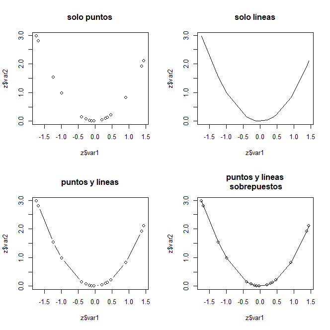

<p align="left">
<strong><a href="../Indice.md">Indice</a></strong>
|
<strong><a href="../Intro a R/R.md">R</a></strong>
|
<strong><a href="../Intro a Python/Python.md">Python</a></strong>
|
<strong><a href="../Intro a Jupyter/Jupyter.md">Jupyter</a></strong>
|
<strong><a href="../Intro a github/Github.md">Github</a></strong>
|
<strong><a href="../enlaces.md">Enlaces</a></strong>
</p>


# Gráficas simples

Para mostrar la creación de gráficos muy sencillos  vamos a crear un data frame con dos columnas, la primera que denominaremos "grupo", y la segunda "var1". Este ejemplo ilustra también el uso de la función `rnorm()`, que produce números aleatorios distribuidos normalmente.

```r
> z <- data.frame(grupo = sort(rep(c("a", "b"), 8)), var1 = rnorm(16))
 z
   grupo        var1
1      a -1.72643338
2      a -0.26527464
3      a  0.90966280
4      a  1.44979135
5      a -1.67398040
6      a  0.36335662
7      a  0.31498740
8      a -0.99030394
9      b -0.09442633
10     b -1.23683178
11     b  0.21078494
12     b -0.38752699
13     b  0.46738497
14     b  1.38195784
15     b -0.15212335
16     b -0.03334792
```

 La función `plot()` produce una gráfica de dispersión:

```r
 > plot(z$var1)
```


Si queremos un histograma usamos la función `hist()`:

```r
> hist(z$var1)
```


Ahora intentemos hacer una gráfica de cajas y bigotes de `var1` con respecto al `grupo`, añadiendo título y etiquetas a los ejes `x` y `y`:

 ```r
> boxplot(var1 ~ grupo, data=z, main="boxplot de prueba", xlab = "grupo",
+ ylab = "variable 1")
```


Para explorar otras opciones gráficas, añadiremos una segunda columna a `z`, y después ordenaremos el data frame con respecto a `var1`. A continuación vamos a crear en una sola ventana cuatro gráficas de las mismas variables usando diferentes opciones (solo puntos, solo líneas y ambos):

```r
> z$var2 <- (z$var1)^2
> z <- z[order(z$var1), ]
> par(mfrow=c(2,2))
> plot(z$var1, z$var2, type="p", main="solo puntos")
> plot(z$var1, z$var2, type="l", main="solo líneas")
> plot(z$var1, z$var2, type="b", main="puntos y líneas")
> plot(z$var1, z$var2, type="o", main="puntos y líneas\n sobrepuestos")
```


Se recomienda familiarizarse con la función `par()`, que explica los parámetros gráficos que pueden ser modificados por el usuario, por ejemplo el tamaño de la fuente, símbolos, colores, etc.

