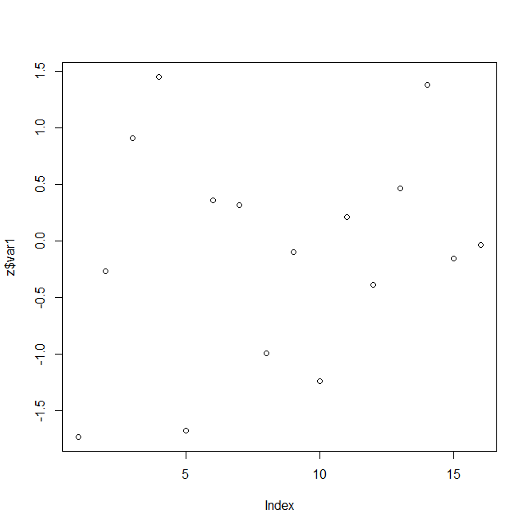
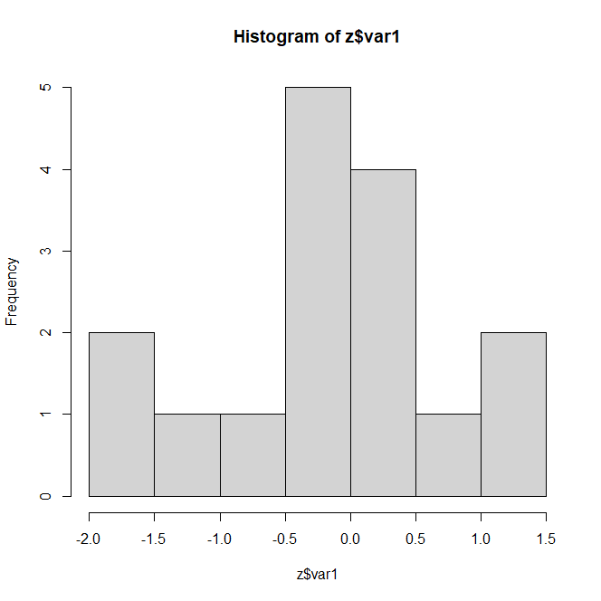
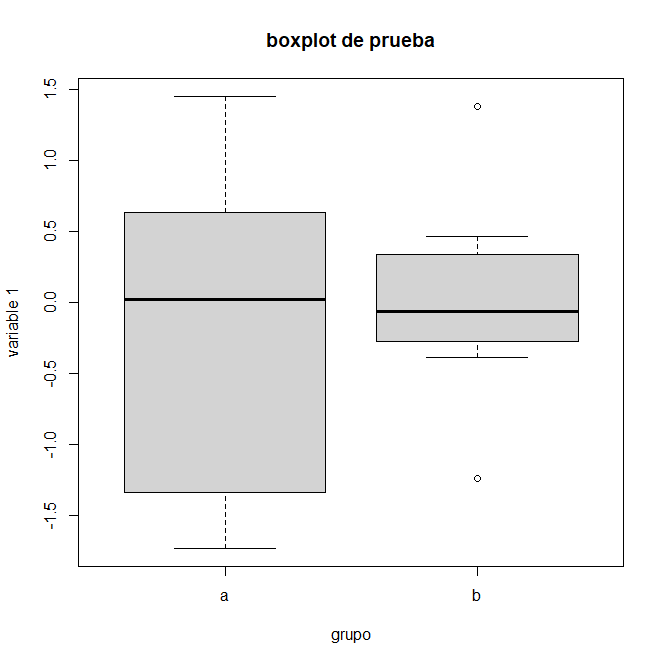
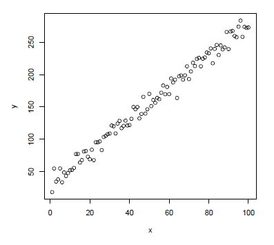

<p align="left">
<strong><a href="../Indice.md">Indice</a></strong>
|
<strong><a href="../Intro a R/R.md">R</a></strong>
|
<strong><a href="../Intro a Python/Python.md">Python</a></strong>
|
<strong><a href="../Intro a Jupyter/Jupyter.md">Jupyter</a></strong>
|
<strong><a href="../Intro a github/Github.md">Github</a></strong>
|
<strong><a href="../enlaces.md">Enlaces</a></strong>
</p>

 

# Introducción a R
**Autores**: Héctor Villalobos y Marian Peña

R es un poderoso y flexible lenguaje de programación para el análisis de datos y la elaboración de gráficas con calidad de publicación.
Este curso introductorio tiene por objeto mostrar el uso básico de R desde un enfoque práctico


## Obtener e Instalar R y Rstudio

La versión más reciente de R puede obtenerse del sitio web oficial: [The R Project for Statistical Computing](http://www.r-project.org/), el cual contiene las ligas hacia diferentes servidores "espejo" distribuidos en todo el mundo. En estos servidores se puede descargar el código fuente de R o una versión precompilada para la plataforma de nuestro interés (Linux, macOS, Windows). En este documento comentaremos la instalación y el uso de R en las versiones más recientes de  Windows.

Una vez descargado el archivo de instalación, basta ejecutarlo haciendo doble click en él. Durante la instalación se irán desplegando una serie de ventanas, en la mayoría de las cuales seleccionaremos las opciones por defecto: 

* Select setup language: Se recomienda seleccionar "**English**". La razón de esto es que aunque el menú de R y algunos mensajes están traducidos en varios idiomas (entre ellos el español) el sistema de ayuda y muchos recursos en Internet solo están disponibles en inglés, por lo que una búsqueda en este idioma producirá más resultados que en español o cualquier otro idioma.

* Information (Licencia): "Next" para continuar

* Select Destination Location: Se recomienda instalar en el directorio por defecto.


* Select Components: "Next" para continuar.

* Startup options: Seleccionar "No (accept defaults)". Si se elige "Yes (customized
  startup)" el programa de instalación pregunta si se desea utilizar el programa en
  modo MDI (una sola ventana) o SDI (ventanas separadas) y si se prefiere la ayuda en modo de
  texto o html.

* Select Start Menu Folder : "Next" para continuar

* Select Additional Tasks: "Next" para continuar

* Completing the R for  Windows 4.2.2 Setup Wizard: "Finish" para terminar

Una manera de facilitar la creación y manipulación de scripts en R es por medio de un editor que resalte la sintaxis con diferentes colores, y al mismo tiempo que pueda interactuar con R enviando código a la consola para su ejecución. Existen diferentes opciones sin embargo dada la facilidad de instalación, de uso y sus características, se recomienda el uso de [RStudio](https://posit.co/download/rstudio-desktop/). RStudio es lo que se conoce como un Ambiente de Desarrollo Integrado (IDE, por sus siglas en inglés) que bajo una misma ventana agrupa el editor de scripts, la consola de R, el workspace con los objetos creados, el histórico de los comandos utilizados, la ayuda, las gráficas, paquetes instalados y archivos en el directorio de trabajo.

La instalación es muy sencilla, basta con aceptar las opciones por defecto.

* Welcome to the RStudio Setup: Pantalla de bienvenida del instalador, seleccionar "Next" para continuar.

* Choose Install Location: Seleccionar carpeta de instalación, puede aceptarse la propuesta por el programa o elegir otra. "Next" para continuar.

* Choose Start Menu Folder : Carpeta para crear atajo para ejecutar el programa, la opción por defecto esta bien. Pulsar "Install" para iniciar la instalacion.

* Completing the RStudio Setup Wizard: Seleccionar "Finish".

## Instalación de paquetes adicionales

La instalación de _packages_ es bastante simple, se puede hacer a partir del menú o de la consola. Los paquetes se encuentran en un servidor de Internet denominado Comprehensive R Archive Network (CRAN) y sus espejos distribuidos en diferentes países. Usualmente, cuando se cuenta con una conexión a Internet adecuada, es preferible instalar desde estos servidores.  Una vez dentro de R, desde el menú seleccionamos la opción: Packages/Install package(s). . . Después será necesario elegir un servidor o "espejo" y a continuación el paquete de nuestro interés en la lista desplegada. Desde la consola podemos usar los comandos: chooseCRANmirror(), que nos permite seleccionar el servidor, e install.packages() indicando el o los packages deseados.
Pongamos un ejemplo:
```r
> chooseCRANmirror() # seleccionar servidor
> install.packages("TeachingDemos", dependencies = TRUE)
```
El argumento dependencies = TRUE instruye a R a descargar e instalar otros paquetes requeridos para el funciónamiento del paquete TeachingDemos. Como puede apreciarse, durante el proceso la consola de R despliega una serie de mensajes, en particular el nombre y tamaño de los archivos descargados, que están en forma de archivos comprimidos (en formato "zip" para la versión de Windows) y que son automáticamente desempacados por R.
Para instalar paquetes previamente descargados en una memoria USB o en una carpeta de la computadora, la instalacón es similar  al caso anterior. Desde el menú, la opción corresponde a Packages/Install package(s) from local zip files. . . , mientras que desde la consola la instrucción completa requiere indicar la ruta en donde se ubican los archivos "zip". La ventaja de usar la consola en lugar del menú radica en que las dependencias también son tomadas en cuenta. Supongamos por ejemplo que \G" es la letra asignada por Windows a nuestra memoria, entonces la sintaxis sería:
```r
> install.packages("TeachingDemos", repos = NULL,
  contriburl = "file:///G:/Software/R/contrib_packages",
  dependencies = TRUE)
```
Una vez instalado un paquete, es necesario cargarlo desde la biblioteca (_library_) que esté disponible para usarlo en la sesión, en el caso de nuestro ejemplo:
```r
> library(TeachingDemos)
```
Podemos ahora ver la ayuda de este paquete
```r
> ?TeachingDemos
```
y ensayar los ejemplos de alguna función, por ejemplo my.symbols():
```r
> example(my.symbols)
```
Cuando ya no necesitamos el paquete podemos desactivarlo usando el comando:
```r
> detach("package:TeachingDemos")
```

En el sitio de R se puede consultar la lista de paquetes disponibles con una breve
descripción de los mismos. Se recomienda buscar el paquete útil para
resolver un problema específico, en lugar de intentar instalar y explorar todos los paquetes
disponibles.


## Operaciones simples

Con R podemos realizar cualquier operación aritmética usando los operadores habituales:

```r
> 3+6
[1] 9
> 8*9
[1] 72
> 10-8
[1] 2
> 5/2
[1] 2.5
> 4^2
[1] 16
> log(100)
[1] 4.60517
> log10(100)
[1] 2
> exp(2)
[1] 7.389056
> sqrt(16)
[1] 4
```
<details>
<summary>Ejercicio: calcula el seno y coseno de 90. Dale click para ver la solución</summary>
 ```r
# las funciones trigonométricas en R esperan los ángulos en radianes
> sin(90*pi/180) 
[1] 1
> cos(90*pi/180)
[1] 6.123032e-17
```
</details>

## Objetos en R

R opera a través de estructuras de datos que tienen nombre. Pueden ser de diferentes tipos, dependiendo de su estructura y de los datos que contengan, así podemos distinguir entre vectores, matrices, _data frames_ y listas principalmente (aunque las funciones también son objetos). Conocer el tipo de objeto es importante porque determina en gran medida las operaciones que podemos efectuar con ellos.

Para ilustrar las diferentes estructuras de datos utilizaremos el operador de asignación (_assignment_): "<-", el cual permite asignar un valor o una colección ordenada de valores a un objeto determinado.

Por ejemplo, la instrucción
```r
> b <- 5
```
asigna el valor 5 al objeto denominado b. Ese vector (de longitud uno) estará disponible para operaciones subsecuentes:
```r
> 10*b
[1] 50
> sqrt(b)
[1] 2.236068
```
###  Vectores

Los vectores son el tipo de estructura más simple en R. Asignemos por ejemplo una serie de números del 1 al 6 a un objeto que llamaremos w. Para ello utilizamos la instrucción:
```r
> w <- 1:6
```
Para verificar el contenido de w simplemente escribimos su nombre:
```r
> w <- 1:6  
> w
[1] 1 2 3 4 5 6
```
Como se puede inferir del ejemplo anterior, ":" sirve para crear una secuencia de números de uno en uno. Si deseamos crear secuencias con intervalos diferentes, por ejemplo cada 0.5 unidades, podemos usar la función seq():
```r
> seq(1, 6, 0.5)
[1] 1.0 1.5 2.0 2.5 3.0 3.5 4.0 4.5 5.0 5.5 6.0
```
En este ejemplo indicamos el inicio (1) y el final (6) de la secuencia, así como el incremento (0.5). Al inicio de la secuencia anterior aparece "[1]", lo que nos indica que R desplegó el resultado a partir del primer valor del vector. Si en un renglón hubiera espacio
para únicamente 20 números, una secuencia que ocupara dos renglones comenzaría en "[1]" en el primer renglón y en "[21]" en el segundo.

Regresando a nuestro ejemplo, w es un vector numérico, pero también podemos tener vectores de caracteres:
```r
> x <- c("a", "a", "a", "b", "b", "b")
> x
[1] "a" "a" "a" "b" "b" "b"
```

En este ejemplo, usamos la instrucción combine c() para combinar las letras en un solo objeto. De manera similar, el vector de nuestro primer ejemplo puede crearse también usando la instrucción: w <- c(1, 2, 3, 4, 5, 6). En el caso de la creación del vector x usamos comillas para indicar que se trata de texto y no de objetos ya existentes. Imaginemos que en algún momento de la sesión se hicieron las asignaciones a <- 2.5 y b <- 3.6 y después lo olvidamos. Si en un momento posterior de la misma sesión deseáramos crear el vector de caracteres del ejemplo anterior pero olvidásemos usar las comillas, el resultado sera totalmente diferente:

```r
> xx <- c(a, a, a, b, b, b)
> xx
[1] 2.5 2.5 2.5 3.6 3.6 3.6
```

Ademas de los vectores numéricos y de caracteres que acabamos de ejemplificar, también hay vectores lógicos que resultan de la evaluación de expresiones:

```r
> ww <- w > 4
> ww
[1] FALSE FALSE FALSE FALSE TRUE TRUE
```

Este ultimo tipo de vector es muy útil para indexar otros vectores, pues nos permite, por ejemplo, extraer elementos específicos que cumplen con cierta condición (en este caso, aquellos que son mayores que 4):

```r
> w[ww]
[1] 5 6
```

### Matrices

El siguiente tipo de objeto que nos interesa es la matriz:
```r
> y <- matrix(1:20, ncol = 4)
> y
     [,1] [,2] [,3] [,4]
[1,]    1    6   11   16
[2,]    2    7   12   17
[3,]    3    8   13   18
[4,]    4    9   14   19
[5,]    5   10   15   20
```

Nótese como hemos indicado el número de columnas que querríamos con el argumento ncol. También podemos precisar como queremos que los datos sean ordenados en la matriz al incluir el argumento byrow, que instruye a la función matrix() a llenar primero los renglones:

```r
> matrix(1:20, byrow = TRUE, ncol = 4)
     [,1] [,2] [,3] [,4]
[1,]    1    2    3    4
[2,]    5    6    7    8
[3,]    9   10   11   12
[4,]   13   14   15   16
[5,]   17   18   19   20
```

Incluso podemos asignar nombres a las columnas y renglones de la matriz, para lo cual añadimos el argumento dimnames:

```r
> y <- matrix(1:20, byrow = TRUE, ncol = 4, dimnames = list(paste("r", 1:5, sep = ""), paste("c", 1:4, sep = ".")))
> y
   c.1 c.2 c.3 c.4
r1   1   2   3   4
r2   5   6   7   8
r3   9  10  11  12
r4  13  14  15  16
r5  17  18  19  20 
```

El valor de dimnames en la función anterior utiliza otras funciones (list() y paste()) con sus respectivos argumentos. Para comprender su propósito podemos evaluarlas de  manera independiente.  

### _Data frames_

Una característica que comparten los vectores y las matrices es que solo pueden contener el mismo tipo de valores (numéricos, caracteres o lógicos). En muchas ocasiones, nuestros datos contienen una mezcla de variables numéricas y factoriales. Esta información puede manejarse por medio de un data frame, muy similar a la matriz pero que puede contener mas de un tipo de datos:

```r
> z <- data.frame(x, w)
> z
  x w
1 a 1
2 a 2
3 a 3
4 b 4
5 b 5
6 b 6
```

### Listas

Una lista pude combinar cualquier tipo de objetos, incluyendo otras listas.
```r
> Z <- list(V.w = 2*w, V.x = x, M.y = log(y))
> Z
$V.w
[1] 2 4 6 8 10 12

$V.x
[1] "a" "a" "a" "b" "b" "b"

$M.y
        c.1       c.2      c.3      c.4
r1 0.000000 0.6931472 1.098612 1.386294
r2 1.609438 1.7917595 1.945910 2.079442
r3 2.197225 2.3025851 2.397895 2.484907
r4 2.564949 2.6390573 2.708050 2.772589
r5 2.833213 2.8903718 2.944439 2.995732
```

Es importante mencionar que R es sensible al uso de mayúsculas/minúsculas, de tal forma que nuestros objetos z y Z son diferentes.

### Indexar objetos

Podemos tener acceso a elementos particulares de un objeto usando índices. Por ejemplo, si nos interesan los primeros tres elementos del vector x:

```r
> x[1:3]
[1] "a" "a" "a"
```

En el caso de matrices y data frames debemos indicar también la columna, por ejemplo, para extraer de la matriz y los elementos correspondientes a los renglones 4-5 y a las columnas 3-4 escribimos:

```r
> y[4:5, 3:4]
  c.3 c.4
r4 15  16
r5 19  20
```
<details>
<summary>Ejercicio: selecciona la columna 2 de y completa. Dale click para ver la solución</summary>
 ```r
> y[, 2]
r1 r2 r3 r4 r5
 2  6 10 14 18
```
</details>

En el caso de un data frame ademas podemos acceder a las columnas mediante el nombre del data frame seguido del símbolo "$" y del nombre de la columna:

```r
> z$x
[1] a a a b b b
Levels: a b
> z$w
[1] 1 2 3 4 5 6
```

Por último, en el caso de las listas procedemos de manera similar:

```r
> Z$M.y
        c.1       c.2      c.3      c.4
r1 0.000000 0.6931472 1.098612 1.386294
r2 1.609438 1.7917595 1.945910 2.079442
r3 2.197225 2.3025851 2.397895 2.484907
r4 2.564949 2.6390573 2.708050 2.772589
r5 2.833213 2.8903718 2.944439 2.995732
```

Para extraer solo los renglones tercero y cuarto de la segunda columna de la matriz  anterior:

```r
> Z$M.y[3:4, 2]
      r3       r4
2.302585 2.639057
```
o de manera alternativa:

```r
> Z[[3]][3:4, 2]
      r3       r4
2.302585 2.639057
```

### Atributos de los objetos 
Una vez que los objetos han sido creados podemos saber a que clase pertenecen inspeccionándolos o de manera mas precisa usando la función class(). Veamos lo reportado por esta función para los objetos creados hasta este momento:

```r
> class(w); class(x); class(ww); class(y); class(z); class(Z)
[1] "integer"
[1] "character"
[1] "logical"
[1] "matrix"
[1] "data.frame"
[1] "list"
```

Los objetos en R tienen atributos, por ejemplo el modo en que están almacenados (mode(), "numeric", "character", "logical", . . . ) y su longitud (length()), que corresponde al número total de elementos de un vector o matriz, mientras que en el caso de un data frame es el número de columnas, y en una lista el número de elementos de esta. Otros atributos de un objeto corresponden a sus dimensiones y nombres de las columnas y renglones (o de los elementos de la lista). La función attributes() puede ser útil para conocer algunos de estos atributos, aunque str() nos proporciona mayores detalles sobre la estructura del objeto.

```r
> attributes(w); str(w)
NULL
 int [1:6] 1 2 3 4 5 6
> attributes(Z); str(Z)
$names
[1] "V.w" "V.x" "M.y"
List of 3
 $ V.w: num [1:6] 2 4 6 8 10 12
 $ V.x: chr [1:6] "a" "a" "a" "b" ...
 $ M.y: num [1:5, 1:4] 0 1.61 2.2 2.56 2.83 ...
  ..- attr(*, "dimnames")=List of 2
  .. ..$ : chr [1:5] "r1" "r2" "r3" "r4" ...
  .. ..$ : chr [1:4] "c.1" "c.2" "c.3" "c.4"
```

Ahora utilicemos algunos de los objetos creados previamente para ilustrar algunas operaciones sencillas. Por ejemplo, si queremos calcular la raíz cuadrada de los elementos del vector w usamos la función sqrt():

```r
> sqrt(w)
[1] 1.000000 1.414214 1.732051 2.000000 2.236068 2.449490
```

La sintaxis en el caso de una matriz es idéntica:

```r
> sqrt(y)
        c.1      c.2      c.3      c.4
r1 1.000000 1.414214 1.732051 2.000000
r2 2.236068 2.449490 2.645751 2.828427
r3 3.000000 3.162278 3.316625 3.464102
r4 3.605551 3.741657 3.872983 4.000000
r5 4.123106 4.242641 4.358899 4.472136
```

La diferencia con una hoja de cálculo, donde la fórmula se tiene que aplicar a cada elemento -ya sea escribiéndola o copiándola-, es evidente. También podemos aplicar una operación de este tipo a una sola columna de una matriz o de un data frame:

```r
sqrt(z$w)
> [1] 1.000000 1.414214 1.732051 2.000000 2.236068 2.449490
```

En este caso especificamos que nos interesa la columna w del data frame z. Alternativamente, podemos emplear la notación: sqrt(z[ , 2]). Para las operaciones con vectores y matrices, es importante la notación empleada para obtener el resultado deseado:

```r
> A <- matrix(c(1,2,3,4), ncol = 2)
> b <- c(2,3)
```

La operación A * b ejecuta la multiplicación elemento por elemento, y es equivalente a  b * A


```r
> A * b
    [,1] [,2]
[1,]   2    6
[2,]   6   12
```

En cambio, el producto matricial


se obtiene mediante:
```r
> A %*% b
     [,1]
[1,]   11
[2,]   16
```

La transposición de una matriz se obtiene mediante:

```r
> t(A)
     [,1] [,2]
[1,]    1    2
[2,]    3    4
```

Y la inversa
```r
> solve(A)
     [,1]  [,2]
[1,]   -2   1.5
[2,]    1  -0.5
```

## Gráficas simples

Para mostrar la creación de gráficos sencillos vamos a crear un "data frame" con dos columnas, la primera que denominaremos "grupo", y la segunda "var1". Este ejemplo ilustra también el uso de la función rnorm(), que produce números aleatorios distribuidos
normalmente.

```r
> z <- data.frame(grupo = sort(rep(c("a", "b"), 8)), var1 = rnorm(16))
 z
   grupo        var1
1      a -1.72643338
2      a -0.26527464
3      a  0.90966280
4      a  1.44979135
5      a -1.67398040
6      a  0.36335662
7      a  0.31498740
8      a -0.99030394
9      b -0.09442633
10     b -1.23683178
11     b  0.21078494
12     b -0.38752699
13     b  0.46738497
14     b  1.38195784
15     b -0.15212335
16     b -0.03334792
```

 La función plot() produce una gráfica de dispersión:

```r
 > plot(z$var1)
```


Si queremos un histograma usamos la función hist():

```r
> hist(z$var1)
```



Ahora intentemos hacer una gráfica de cajas y bigotes de var1 con respecto al grupo, añadiendo titulo y etiquetas a los ejes x y y:

 ```r
> boxplot(var1 ~ grupo, data=z, main="boxplot de prueba", xlab = "grupo",
+ ylab = "variable 1")
```



Para explorar otras opciones gráficas, añadiremos una segunda columna a z, y después ordenaremos el data frame con respecto a var1. A continuación vamos a crear en una sola ventana cuatro gráficas de las mismas variables usando diferentes opciones (solo puntos, solo líneas y ambos):

```r
> z$var2 <- (z$var1)^2
> z <- z[order(z$var1), ]
> par(mfrow=c(2,2))
> plot(z$var1, z$var2, type="p", main="solo puntos")
> plot(z$var1, z$var2, type="l", main="solo líneas")
> plot(z$var1, z$var2, type="b", main="puntos y líneas")
> plot(z$var1, z$var2, type="o", main="puntos y líneas\n sobrepuestos")
```


Se recomienda familiarizarse con la función par(), que explica los parámetros gráficos que pueden ser modificados por el usuario, por ejemplo el tamaño de la fuente, símbolos, colores, etc.

Para saber que objetos tenemos disponibles, podemos enlistarlos usando la funcion objects(), o bien:
```r
> ls()
[1] "a" "A" "b" "w" "ww" "x" "xx" "y" "z" "Z"
```

Si ahora queremos eliminar permanentemente algún objeto en particular, digamos la
matriz y usamos:
```r
> rm(y)
```

o podemos borrar todos los objetos de una sola vez:
```r
> rm(list = ls())
```

Los objetos cuyo nombre comienza por "." están ocultos y no pueden ser mostrados ni borrados como se acaba de explicar. Para ejemplificar esto, creemos un objeto al que llamaremos .invisible:
```r
> .invisible <- rnorm(20)
```
ahora ejecutemos los comandos siguientes:
```r
> ls()
character(0)
```
Como se aprecia, la función ls() no despliega los objetos ocultos. Para desplegarlos requerimos añadir el argumento all = TRUE a dicha función:
```r
> ls(all = TRUE)
[1] ".invisible" ".Random.seed"
```
el objeto .Random.seed fue creado por la función rnorm() usada previamente. Veamos ahora lo que sucede al intentar borrar a todos los objetos como se hizo anteriormente:
```r
> rm(list = ls())
> ls(all = TRUE)
[1] ".invisible" ".Random.seed"
```
Como podemos ver, los dos objetos ocultos siguen ahí. La notación correcta para borrarlos sera la siguiente:
```r
> rm(list = ls(all = TRUE))
> ls(all = TRUE)
character(0)
```


## Ayuda de funciones y paquetes

Podemos acceder al sistema de ayuda de R mediante "?" seguido del nombre de la función que nos interesa o con el comando help(). Probemos esto con algunas de las funciones que hemos utilizado hasta el momento:
```r
> ?ls
> help("rnorm")
> help(par)
> help.search("linear models")
```

<details>
<summary>Ejercicio: busca ayuda sobre la función 'hist'. Dale click para ver la solución</summary>
 ```r
> help("hist")
```
</details>

A partir del menu Help también podemos acceder a la ayuda compilada en html, a los diferentes manuales de R en formato pdf que se crearon durante la instalación, a los archivos en línea de la lista de correo de ayuda de R, etc.

## Importar datos externos
En los primeros ejemplos vimos la manera de introducir datos y crear objetos a partir del teclado, pero lo mas usual es que tengamos nuestra información en alguna hoja de cálculo o base de datos. 

### Desde el portapapeles
Cuando la cantidad de datos es pequeña y su formato sencillo, podemos pasarlos directamente del archivo a la consola de R por medio del portapapeles. Para ello primero copiamos los datos al portapapeles y después escribimos en la consola la instrucción:
```r
> x <- read.delim("clipboard")
```

### Mediante read.table()
Cuando el tamaño de los datos es importante, es preferible usar otro método para leerlos en R. Los archivos de Excel y de Access pueden ser importados mediante funciónes especiales, sin embargo lo mas sencillo es exportar nuestros datos en formato ascii, puesto que todas las hojas de calculo y manejadores de bases de datos tienen esta capacidad. Se sugiere salvar los datos en un archivo de texto, con nombres de columnas que empiecen por una letra y sin espacios (si se desean nombres compuestos se puede usar un guion bajo) y usando tabuladores como separadores de columnas (aunque R puede importar datos sin nombres de columnas y separados por espacios, comas, etc.). Uno de los comandos de importación de datos externos que mas utilizaremos es read.table() y su sintaxis es la siguiente:
```r
> x <- read.table("ruta/archivo", header, sep)
```
Del lado izquierdo del assignment, x corresponde al objeto que contendrá los datos del archivo importado. Del lado derecho, ruta se refiere a un directorio, por ejemplo "G:/datos" y archivo al nombre -incluyendo la extension (".txt", ".dat")- del archivo externo que contiene los datos. Los argumentos header y sep indican si el archivo incluye (TRUE) o no (FALSE) nombres de columnas y el separador de las mismas. Por defecto, este último es un número variable de espacios, pero puede ser también un solo espacio  (sep = " "), un tabulador (sep = "\\t"), una coma (sep = ",") o punto y coma (sep = ";"). 

Una vez importados los datos, estarán disponibles para ser analizados dentro de R. Es importante señalar que el archivo original permanece sin cambios y que los datos solo están disponibles mientras la sesión actual de R se mantenga abierta. Si en una sesión posterior deseamos usar los mismos datos debemos importarlos nuevamente, a menos que hayamos guardado el workspace y se haya restaurado en la nueva sesión. 

Una sesión formal de R requiere que definamos nuestro directorio de trabajo ("working directory", wd). Eso simplificará mucho la importación y exportación de datos y figuras, ademas de que nos ayudara a mantener organizado nuestro trabajo. Para conocer el directorio de trabajo actual usamos el comando getwd(), mientras que definimos uno diferente mediante setwd(), por ejemplo:
```r
> setwd('G:/analisis')
```
De esta manera, la sintaxis  puede simplificar son necesidad de escribir toda la ruta al archivo:
```r
> a00 <- read.table("./datos/archivo_00.txt", header = TRUE, sep = "\t")
```
El "." antes de la diagonal inicial sirve para indicar que "datos" es un subdirectorio de "G:/analisis". 

### Desde archivos Excel

Para importar este tipo de archivos es necesario el uso de paquetes adicionales. Actualmente el más sencillo de instalar y utilizar es readxl, el cual permite importar archivos tanto "xls" como "xlsx". 

Por ejemplo
```r
> library(readxl)
> datos <- read_excel("./datos/archivo_04.xls", sheet = 1)
```
En este caso sheet = 1 indica que nos interesa la primera hoja del archivo, la cual también se puede indicar por nombre: sheet = "A".
Se recomienda ver la ayuda de la función read_excel para mayores detalles.

Otro paquete interesante para este propósito es RODBC. La secuencia completa de pasos para importar un archivo de Excel, requiere (1) cargar el paquete, (2) establecer una conexión al archivo, (3) leer los nombres de las hojas del archivo Excel y (4) importar la hoja que nos interesa. La sintaxis es la siguiente:
```r
> library(RODBC)
> con <- odbcConnectExcel("./datos/archivo_04.xls")
> sqlTables(con)
> a04pA <- sqlFetch(con, "A_1962")
```
En este ejemplo, con es unicamente la conexión al archivo archivo_04.xls y es a través de ella que consultamos los nombres de las hojas Excel (sqlTables(con)) e importamos aquella que nos interesa (sqlFetch(con, "A_1962")). Adicionalmente, si ya no se van a importar mas datos se cierra la conexión y se quita el paquete de la memoria:
```r
> closeAllConnections()
> detach("package:RODBC")
```
El procedimiento para importar datos de un archivo Access mediante el paquete RODBC es equivalente, solamente se requiere sustituir la función que establece la conexión al archivo correspondiente (odbcConnectAccess()). Mas detalles acerca de la importación de estos y otros tipos de archivos se pueden consultar en el manual R Data Import/Export (R-data.pdf) que se encuentra bajo la carpeta doc/manual de la instalación de R.


## Algunos análisis estadísticos

    1. Análisis de datos temporales
    
Vamos ahora a desarrollar un ejemplo mas completo de importación y análisis de datos utilizando el archivo cibmeteo.txt. Estos datos corresponden a lecturas de la temperatura del aire, la humedad relativa, la velocidad y dirección del viento registradas cada media hora de junio de 2006 a mayo de 2007 en la estación meteorológica del CIBNOR en el Comitán, B.C.S. Veamos las
dimensiones de este archivo y las variables que contiene:
```r
> cibmeteo <- read.table("cibmeteo.txt", header=TRUE, sep="\t")
> dim(cibmeteo)
[1] 17364 8
> names(cibmeteo)
[1] "year" "month" "day" "hour"
[5] "temperature" "rel_hum" "wind_spd" "wind_dir"
```
Para tener una primera impresión de los datos, la función summary() produce una
serie de estadísticas descriptivas:
```r
> summary(cibmeteo)
     year          month             day            hour          
 Min.   :2006   Min.   : 1.000   Min.   : 1.00   Length:17364      
 1st Qu.:2006   1st Qu.: 4.000   1st Qu.: 8.00   Class :character  
 Median :2006   Median : 7.000   Median :16.00   Mode  :character  
 Mean   :2006   Mean   : 6.555   Mean   :15.67                     
 3rd Qu.:2007   3rd Qu.:10.000   3rd Qu.:23.00                     
 Max.   :2007   Max.   :12.000   Max.   :31.00                     
  temperature        rel_hum           wind_spd        wind_dir     
 Min.   : 4.497   Min.   :  3.681   Min.   :0.000   Min.   :  0.00  
 1st Qu.:18.668   1st Qu.: 45.568   1st Qu.:0.395   1st Qu.: 26.09  
 Median :24.410   Median : 64.430   Median :1.121   Median :159.60  
 Mean   :24.132   Mean   : 62.923   Mean   :1.092   Mean   :146.49  
 3rd Qu.:29.250   3rd Qu.: 82.100   3rd Qu.:1.663   3rd Qu.:226.00  
 Max.   :39.790   Max.   :100.500   Max.   :6.525   Max.   :360.00 
```
Analicemos la temperatura del aire, haciendo un primer gráfico de líneas:
```r
> plot(cibmeteo$temperature, type="l", col = "grey")
```


Dada la frecuencia de las lecturas de temperatura, esta figura resulta poco útil. Procedamos a resumir la información de alguna manera. Calculemos por ejemplo los extremos (mínimo y máximo) y el promedio diario de la temperatura a partir de las 48 lecturas de cada día. Para ello necesitamos crear un índice que identifique de manera única a cada día, pues en el archivo el año, el mes y el día se encuentran en columnas separadas.
```r
> attach(cibmeteo)
> fecha <- paste(year, month, day, sep = "-")
> fecha <- strptime(fecha, "%Y-%m-%d")
> fecha_txt <- as.character(fecha)
> taire <- as.data.frame(
+    cbind(tapply(temperature, list(fecha_txt), min),
+          tapply(temperature, list(fecha_txt), max),
+          tapply(temperature, list(fecha_txt), mean)))
> detach(cibmeteo)
```
La función attach() nos permite acceder a las variables contenidas en un data frame
directamente. En nuestro ejemplo, no fue necesario especificar cibmeteo$temperature para acceder a la variable temperature dentro del data frame cibmeteo. Otra función muy util en este ejemplo es tapply(), que nos permite aplicar una función (min, max, mean) a cada celda de una matriz definida por una combinación única de uno a varios factores (fecha_txt en nuestro ejemplo).
Bien, ahora asignemos nombres significativos a las columnas de nuestro nuevo data
frame:

```r
> colnames(taire) <- c('tmin', 'tmax', 'tavg')
```
Cuando se usa mas de un factor, la función tapply() genera por defecto una tabla.
Supongamos por ejemplo que nos interesa el promedio mensual de temperatura, el código sería el siguiente:
```r
> attach(cibmeteo)
> tapply(temperature, list(month, year), mean)
       2006     2007
1        NA 17.05386
2        NA 18.63466
3        NA 21.39798
4        NA 21.73464
5        NA 24.13266
6  27.56828       NA
7  30.23218       NA
8  30.21151       NA
9  28.60434       NA
10 27.16089       NA
11 22.68055       NA
12 19.44399       NA
```
Una manera alternativa de obtener estos valores pero organizados de manera diferente (e.g. en un vector) sería usando la función aggregate():
```r
> aggregate(temperature, by=list(mes=month, año=year), mean)
   mes  año        x
1    6 2006 27.56828
2    7 2006 30.23218
3    8 2006 30.21151
4    9 2006 28.60434
5   10 2006 27.16089
6   11 2006 22.68055
7   12 2006 19.44399
8    1 2007 17.05386
9    2 2007 18.63466
10   3 2007 21.39798
11   4 2007 21.73464
12   5 2007 24.13266
> detach(cibmeteo)
```
Regresando a los promedios diarios calculados antes, vamos a suavizar los datos con un método que es comúnmente utilizado con este propósito: los promedios móviles. Este método consiste en definir una ventana de cierta longitud, por ejemplo 3 (denominado orden=3), y obtener el promedio de los valores primero al tercero, segundo al cuarto, tercero al quinto y por ultimo del valor n-2 al n. Supóngase que tenemos el vector Z con 8 valores:
```r
> Z <- c(4, 8, 9, 7, 8, 9, 4, 5)
```
y deseamos calcular el promedio móvil de orden 3. Los cálculos a realizar serán: (4+8+9)/3; (8+9+7)/3; (9+7+8)/3; (7+8+9)/3; (8+9+4)/3; (9+4+5)/3; lo que resultaría en el vector:

```r
> Z.pmov <- c(7, 8, 8, 8, 7, 6)
```
cuya longitud (6) es menor que la del vector original (8). Entonces, si deseamos comparar gráficamente ambos vectores, lo mejor es que ambos tengan la misma longitud. En este ejemplo se puede hacer agregando NA al inicio y al final de Z.pmov para centrar la serie suavizada con respecto a la serie original:
```r
> Z.pmov <- c(NA, Z.pmov, NA)
> Z.pmov
[1] NA 7 8 8 8 7 6 NA
```
Para vectores de mayor longitud estos cálculos manuales resultan tediosos, por lo que vamos a crear nuestra primera función, a la que denominaremos "pmov" y que usaremos para calcular el promedio móvil de las temperaturas de manera mas rápida y sencilla:
```r
> pmov <- function(x, k) {
   n <- length(x)
   y <- rep(NA, n)
   for (i in k:n)
    y[i-floor(k/2)] <- mean( x[(1+i-k):i] )
   y
 }
```
En esta función x es el vector a suavizar y k es el orden. "pmov" calcula primero la longitud del vector, después genera un vector vacío (y) de la misma longitud de x y por ultimo calcula los promedios correspondientes. Apliquemos esta función a la temperatura diaria promedio con un orden igual a 15 días 

```r
> tmean.pmov <- pmov(taire$tavg, 15)
``` 

Ahora procedamos a graficar la temperatura diaria promedio sobreponiendo los promedios móviles que hemos calculado:
```r
> plot(taire$tavg, type = "o",ylab = "temperatura (°C)",xlab="día",
   main = "Temp. diaria promedio en La Paz \n (junio 2006 a mayo 2007)",
   lty = 3, col="grey50", lwd = 1)
> lines(tmean.pmov, lwd = 2, col = "blue")
```


 

También podemos presentar esta información como anomalías:
```r
> anomalia <- tmean.pmov-mean(tmean.pmov, na.rm=TRUE)
> anomalia[is.na(anomalia)] <- 0
```

Para la figura correspondiente, pero esta vez usando etiquetas adecuadas para los meses en el eje 'x' y dibujando un polígono que es como se suele representar este tipo de información, necesitamos obtener el numero de días de cada mes. Primero extraemos los valores únicos de las primeras tres columnas de cibmeteo con la función unique() y a continuación contamos los días por mes y por año con ayuda de la función aggregate()

```r
> dias <- unique(cibmeteo[, 1:3])
> ndmes <- aggregate(dias$day, by = list(dias$month, dias$year), length)
> ndmes
   Group.1 Group.2  x
1        6    2006 30
2        7    2006 31
3        8    2006 31
4        9    2006 30
5       10    2006 31
6       11    2006 30
7       12    2006 31
8        1    2007 31
9        2    2007 28
10       3    2007 31
11       4    2007 30
12       5    2007 30
```

usaremos el vector ndmes\$x para dibujar un grid vertical y poner las etiquetas en la gráfica:
```r
> plot(anomalia, type="n", ylab = "anomalía de temperatura", xlab = "",
+ xaxt = "n" )
> polygon(c(1:364, 364:1), c(anomalia, rep(0, 364)), col="green")
> abline(h=0, v=c(0, cumsum(ndmes$x)), col="black", lty=3)
> axis(1, at=cumsum(ndmes$x)-ndmes$x/2, labels = c("jun","jul","ago",
+ "sep","oct","nov","dic","ene","feb","mar","abr","may"))
```


## Exportar tablas y figuras
Si deseamos exportar algunos de nuestros resultados podemos usar el comando:
```r
> write.table(taire, file = "temp_aire.txt", quote = FALSE, sep = "\t",
  dec = ".", row.names = TRUE, col.names = TRUE)
```
Las figuras pueden salvarse en diversos formatos a partir del menú File/Save As de
la ventana gráfica, o bien dentro de nuestro script podemos especificarlo:
```r
> savePlot(filename="Figura_1.png", type="png")
```
En ambos casos, tanto las figuras como las tablas serán guardadas en el directorio de trabajo especificado previamente.

<details>
<summary>Ejercicio: salva los datos de la variable 'taire' en un fichero de texto llamado 'taire_datos' separado por punto y coma indicando la coma como separador decimal. Dale click para ver la solución</summary>
 ```r
> write.table(taire, file = "taire_datos", quote = FALSE, sep = ";",
  dec = ".", row.names = TRUE, col.names = TRUE)
```
</details>


    2. Análisis de regresión lineal
    
Para este ejemplo vamos a generar un par de variables ficticias. La variable independiente consistiría en una serie de valores del 1 al 100, y la variable dependiente será calculada usando un valor de 2.5 para la pendiente y de 31 para la ordenada al origen,añadiendo un termino de error aleatorio a la ecuación de la recta:

```r
> x <- 1:100
> y <- 2.5*x + 31 + (rnorm(100) * 9)
```
Creemos la gráfica de dispersión de nuestras variables ficticias:

```r
> plot(x, y)
```


Y ahora procedamos a efectuar la regresión usando la función lm(), para lo cual debemos especificar el modelo en notación de formula: $$y \sim x$$

Esta formula es equivalente a: $Y = aX + b$ dado que por defecto, la función lm() calcula el intercepto. Si se desea forzar el intercepto a cero, el modelo debe escribirse de la siguiente forma:

$$y \sim x + 0$$

Apliquemos pues la función lm() guardando el resultado en un objeto denominado xy.lm:
```r
 > xy.lm <- lm(y ~ x)
```
Para ver el resultado de la regresión utilizamos la función summary():

```r
> summary(xy.lm)

Call:
lm(formula = y ~ x)

Residuals:
     Min       1Q   Median       3Q      Max 
-22.0826  -5.7734   0.5228   4.5519  18.8191 

Coefficients:
            Estimate Std. Error t value Pr(>|t|)    
(Intercept) 29.99031    1.66509   18.01   <2e-16 ***
x            2.51950    0.02863   88.02   <2e-16 ***
---
Signif. codes:  0 ‘***’ 0.001 ‘**’ 0.01 ‘*’ 0.05 ‘.’ 0.1 ‘ ’ 1

Residual standard error: 8.263 on 98 degrees of freedom
Multiple R-squared:  0.9875,	Adjusted R-squared:  0.9874 
F-statistic:  7747 on 1 and 98 DF,  p-value: < 2.2e-16
```
Otros detalles del objeto xy.lm pueden verse con la función attributes():

```r
> attributes(xy.lm)
$names
[1] "coefficients" "residuals" "effects" "rank"
[5] "fitted.values" "assign" "qr" "df.residual"
[9] "xlevels" "call" "terms" "model"
$class
[1] "lm"
```
Para extraer los coeficientes de la regresión:

```r
> coef(xy.lm)
(Intercept) x
29.99031 2.51950
```
A continuación podemos añadir el modelo ajustado a la figura anterior:

```r
> abline(xy.lm)
```


Por último, podemos explorar los residuales

```r
> par(mfrow=c(2,2))
> plot(xy.lm)
```


    3. Estimación no lineal 
Como en el ejemplo anterior generamos dos variables ficticias X y Y. En el caso de Y utilizamos un modelo potencial sin olvidar agregar un término de error aleatorio.

```r
> X <- seq(1, 20, length=100)
> Y <- 2.5 *( X+runif(100)*3 )^2.5
```

<details>
<summary>Ejercicio: crea la gráfica para explorar visualmente la relación entre las dos variables. Dale click para ver la solución</summary>
 ```r
> plot(X, Y)
```
</details>
    


Ahora usemos la función de estimación no lineal nls(). En este caso, ademas de especificar el modelo a ajustar $(Y \sim a*X^b)$ debemos especificar valores iniciales de los parámetros de la función. El algoritmo por defecto es el de Gauss-Newton (ver la ayuda de la función nls() para mayores detalles).

```r
> modelo.potencial <- nls(Y ~ a * X^b, start = list(a=1, b=1), trace=TRUE,
+ algorithm="default", model = TRUE)
567164091 : 1 1
565769406 : 0.5182804 1.3203834
562881757 : 0.2159211 1.7617258
549027633 : 0.1885474 2.1288339
529353452 : 0.2916764 2.1929388
495480860 : 0.5002174 2.2127316
435586440 : 0.9047526 2.2174604
334992197 : 1.663137 2.218141
191548384 : 2.990254 2.218180
53250684 : 4.980923 2.218178
7151008 : 6.971593 2.218179
```
Para ver los parámetros ajustados usamos coef(), y la función summary() nos muestra resultados adicionales:   

```r
> coef(modelo.potencial)
a b
6.971593 2.218179
> summary(modelo.potencial)
Formula: Y ~ a * X^b
Parameters:
Estimate Std. Error t value Pr(>|t|)
a 6.97159 1.21540 5.736 1.08e-07 ***
b 2.21818 0.06177 35.913 < 2e-16 ***
---
Signif. codes: 0 '***' 0.001 '**' 0.01 '*' 0.05 '.' 0.1 ' ' 1
Residual standard error: 270.1 on 98 degrees of freedom
Number of iterations to convergence: 10
Achieved convergence tolerance: 1.611e-06
```
Por ultimo, añadimos este modelo final a la gráfica:

```r
> lines(X, predict(modelo.potencial), col="red", lwd=2)
```


La estimación no lineal es sensible a los valores iniciales utilizados, por lo que en ocasiones puede no tener éxito. En esos casos se puede efectuar una estimación previa de los parámetros usando la función optim(). En esta, se requiere un criterio a minimizar, generalmente la suma de los residuales al cuadrado:
                   $\sum X (Y_{obs} - Y_{calc})^2$
y ademas se deben especificar valores semilla para los parámetros, con la ventaja de que la función de optimización es menos exigente respecto a los valores iniciales utilizados.

    4. Análisis de variancia 
Para ilustrar este ultimo caso, utilizaremos un ejemplo de Daniel4 (1993, p. 286). En un estudio del efecto de la glucosa sobre la liberación de insulina, se trataron muestras de tejido pancreático de animales de laboratorio con 5 estimulantes distintos. Posteriormente se determinó la cantidad de insulina liberada. Los datos se encuentran en el archivo "exaov.txt" proporcionado 

```r
> exaov <- read.table("exaov.txt" ,header=TRUE, sep=";")
```
Una vez importados los datos procedemos a examinar el tamaño de la matriz, los nombres de las variables y las estadísticas descriptivas.

```r
> dim(exaov)
[1] 32 2
> names(exaov)
[1] "estimulante" "insulina"
> summary(exaov)
  estimulante       insulina    
 Min.   :1.000   Min.   :1.450  
 1st Qu.:2.000   1st Qu.:3.507  
 Median :3.000   Median :5.395  
 Mean   :3.219   Mean   :5.098  
 3rd Qu.:4.250   3rd Qu.:6.643  
 Max.   :5.000   Max.   :9.030  
```
Nos interesa probar el efecto del estimulante sobre la cantidad de insulina liberada. La función a utilizar es aov() en la que especificamos los argumentos en notación de formula:

```r
> insul.anova <- aov(insulina ~ as.factor(estimulante), data=exaov)
```
Los resultados del análisis los podemos ver invocando el objeto recién creado y con la función summary() usada anteriormente:

```r
> insul.anova
Call:
   aov(formula = insulina ~ as.factor(estimulante), data = exaov)

Terms:
                as.factor(estimulante) Residuals
Sum of Squares               121.18543  41.35739
Deg. of Freedom                      4        27

Residual standard error: 1.237641
Estimated effects may be unbalanced

> summary(insul.anova)
                       Df Sum Sq Mean Sq F value   Pr(>F)    
as.factor(estimulante)  4 121.19  30.296   19.78 1.05e-07 ***
Residuals              27  41.36   1.532                     
---
Signif. codes:  0 ‘***’ 0.001 ‘**’ 0.01 ‘*’ 0.05 ‘.’ 0.1 ‘ ’ 1
```

## Lecturas Recomendadas
1. Everitt, B. y Hothorn, T. 2006. A Handbook of Statistical Analyses Using R Chapman& Hall/CRC, 275 pp.
2. Murrell, P. 2005. R Graphics. Chapman & Hall/CRC. 301 pp.
3. Paradis, E. 2005. R For Beginners. 72 pp. Disponible en Internet: http://cran.
r-project.org/doc/contrib/Paradis-rdebuts_en.pdf
4. R Core Team. 2022. R Language Definition. Version 4.2.2 (2022-10-31) DRAFT.
ISBN 3-900051-13-5. 55 pp.
5. Venables, W. N.y Ripley, B. D. 2002. Modern Applied Statistics with S. 4a Edicion.Springer. 495 pp.
6. Venables, W. N., D.M. Smith y R Development Core Team. 2009. An Introduction to R. Notes on R: A Programming Environment for Data Analysis and Graphics. Version 2.9.1 (2009-06-26). ISBN 3-900051-12-7. 94 pp.
