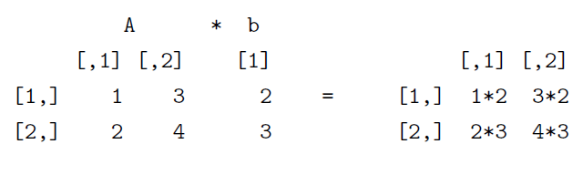
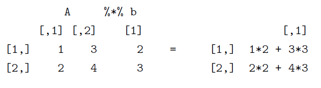

<p align="left">
<strong><a href="../Indice.md">Indice</a></strong>
|
<strong><a href="../Intro-a-R/R.md">R</a></strong>
|
<strong><a href="../Intro-a-Python/Python.md">Python</a></strong>
|
<strong><a href="../Intro-a-Jupyter/Jupyter.md">Jupyter</a></strong>
|
<strong><a href="../Intro-a-github/Github.md">Git y GitHub</a></strong>
|
<strong><a href="../enlaces.md">Enlaces</a></strong>
</p>


# Indexar objetos

En esta sección usaremos los objetos creados en la lección anterior (<a href="../Intro-a-R/03-Objetos.md">Objetos en R</a>).

Podemos tener acceso a elementos particulares de un objeto usando índices. Por ejemplo, si nos interesan los primeros tres elementos del vector `x`:

```r
> x[1:3]
[1] "a" "a" "a"
```

En el caso de matrices y data frames debemos indicar también la columna, por ejemplo, para extraer de la matriz y los elementos correspondientes a los renglones 4-5 y a las columnas 3-4 escribimos:

```r
> y[4:5, 3:4]
  c.3 c.4
r4 15  16
r5 19  20
```
<details>
<summary>Ejercicio: selecciona la columna 2 de `y` completa. Dale click para ver la solución</summary>
  
 ```r
> y[, 2]
r1 r2 r3 r4 r5
 2  6 10 14 18
```
  
</details>

En el caso de un data frame ademas podemos acceder a las columnas mediante el nombre del data frame seguido del símbolo `$` y del nombre de la columna:

```r
> z$x
[1] a a a b b b
Levels: a b
> z$w
[1] 1 2 3 4 5 6
```

Por último, en el caso de las listas procedemos de manera similar:

```r
> Z$M.y
        c.1       c.2      c.3      c.4
r1 0.000000 0.6931472 1.098612 1.386294
r2 1.609438 1.7917595 1.945910 2.079442
r3 2.197225 2.3025851 2.397895 2.484907
r4 2.564949 2.6390573 2.708050 2.772589
r5 2.833213 2.8903718 2.944439 2.995732
```

Para extraer solo los renglones tercero y cuarto de la segunda columna de la matriz  anterior:

```r
> Z$M.y[3:4, 2]
      r3       r4
2.302585 2.639057
```
o de manera alternativa:

```r
> Z[[3]][3:4, 2]
      r3       r4
2.302585 2.639057
```

# Atributos de los objetos 
Una vez que los objetos han sido creados podemos saber a que clase pertenecen inspeccionándolos o de manera más precisa usando la función `class()`. Veamos lo reportado por esta función para los objetos creados hasta este momento:

```r
> class(w); class(x); class(ww); class(y); class(z); class(Z)
[1] "integer"
[1] "character"
[1] "logical"
[1] "matrix"
[1] "data.frame"
[1] "list"
```

Los objetos en R tienen atributos, por ejemplo el modo en que están almacenados (`mode()`, `"numeric", "character", "logical"`, ...) y su longitud (`length()`), que corresponde al número total de elementos de un vector o matriz, mientras que en el caso de un data frame es el número de columnas, y en una lista el número de elementos de esta. Otros atributos de un objeto corresponden a sus dimensiones y nombres de las columnas y renglones (o de los elementos de la lista). La función `attributes()` puede ser útil para conocer algunos de estos atributos, aunque `str()` nos proporciona mayores detalles sobre la estructura del objeto.

```r
> attributes(w); str(w)
NULL
 int [1:6] 1 2 3 4 5 6
> attributes(Z); str(Z)
$names
[1] "V.w" "V.x" "M.y"
List of 3
 $ V.w: num [1:6] 2 4 6 8 10 12
 $ V.x: chr [1:6] "a" "a" "a" "b" ...
 $ M.y: num [1:5, 1:4] 0 1.61 2.2 2.56 2.83 ...
  ..- attr(*, "dimnames")=List of 2
  .. ..$ : chr [1:5] "r1" "r2" "r3" "r4" ...
  .. ..$ : chr [1:4] "c.1" "c.2" "c.3" "c.4"
```

# Usando los objetos 
La ventaja de crear las estructuras de datos explicadas antes es que pueden utilizarse para efectuar cálculos o análisis con estos. Por ejemplo, si queremos obtener  la raíz cuadrada de los elementos del vector `w` simplemente aplicamos la función `sqrt()`a todo el vector:

```r
> sqrt(w)
[1] 1.000000 1.414214 1.732051 2.000000 2.236068 2.449490
```

La sintaxis en el caso de una matriz es idéntica:

```r
> sqrt(y)
        c.1      c.2      c.3      c.4
r1 1.000000 1.414214 1.732051 2.000000
r2 2.236068 2.449490 2.645751 2.828427
r3 3.000000 3.162278 3.316625 3.464102
r4 3.605551 3.741657 3.872983 4.000000
r5 4.123106 4.242641 4.358899 4.472136
```

La diferencia con una hoja de cálculo, donde la fórmula se tiene que aplicar a cada elemento -ya sea escribiéndola o copiándola-, es evidente. También podemos aplicar una operación de este tipo a una sola columna de una matriz o de un data frame:

```r
sqrt(z$w)
> [1] 1.000000 1.414214 1.732051 2.000000 2.236068 2.449490
```
En este caso especificamos que nos interesa la columna `w` del data frame `z`. Alternativamente, podemos emplear la notación: `sqrt(z[ , 2])`. 

Para las operaciones con vectores y matrices, es importante la notación  para obtener el resultado deseado. Vamos a explicar esto creando una matriz `A` y un vector `b`:

```r
> A <- matrix(c(1,2,3,4), ncol = 2)
> b <- c(2,3)
```

La operación `A * b` ejecuta la multiplicación elemento por elemento, y es equivalente a  `b * A`


```r
> A * b
    [,1] [,2]
[1,]   2    6
[2,]   6   12
```

En cambio, el producto matricial, muy utilizado en estadística multivariada



se obtiene mediante el operador `%*%`:
```r
> A %*% b
     [,1]
[1,]   11
[2,]   16
```

La transposición de una matriz se obtiene mediante:

```r
> t(A)
     [,1] [,2]
[1,]    1    2
[2,]    3    4
```

Y la inversa
```r
> solve(A)
     [,1]  [,2]
[1,]   -2   1.5
[2,]    1  -0.5
```


# Borrando objetos

Para saber que objetos tenemos disponibles, podemos enlistarlos usando la funcion `objects()`, o bien:
```r
> ls()
[1] "a" "A" "b" "w" "ww" "x" "y" "z" "Z"
```

Si ahora queremos eliminar permanentemente algún objeto en particular, digamos la 
matriz y usamos:
```r
> rm(y)
```

o podemos borrar todos los objetos de una sola vez:
```r
> rm(list = ls())
```

Los objetos cuyo nombre comienza por "." están ocultos y no pueden ser mostrados ni borrados como se acaba de explicar. Para ejemplificar esto, creemos un objeto al que llamaremos .invisible:
```r
> .invisible <- rnorm(20)
```
ahora ejecutemos los comandos siguientes:
```r
> ls()
character(0)
```
Como se aprecia, la función `ls()` no despliega los objetos ocultos. Para desplegarlos requerimos añadir el argumento `all = TRUE` a dicha función:
```r
> ls(all = TRUE)
[1] ".invisible" ".Random.seed"
```
el objeto `.Random.seed` fue creado por la función `rnorm()` usada previamente. Veamos ahora lo que sucede al intentar borrar a todos los objetos como se hizo anteriormente:
```r
> rm(list = ls())
> ls(all = TRUE)
[1] ".invisible" ".Random.seed"
```
Como podemos ver, los dos objetos ocultos siguen ahí. La notación correcta para borrarlos sera la siguiente:
```r
> rm(list = ls(all = TRUE))
> ls(all = TRUE)
character(0)
```
