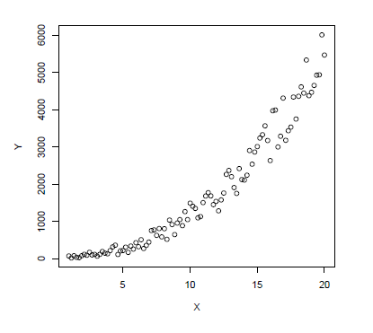

<p align="left">
<strong><a href="../Indice.md">Indice</a></strong>
|
<strong><a href="../Intro-a-R/R.md">R</a></strong>
|
<strong><a href="../Intro-a-Python/Python.md">Python</a></strong>
|
<strong><a href="../Intro-a-Jupyter/Jupyter.md">Jupyter</a></strong>
|
<strong><a href="../Intro-a-github/Github.md">Github</a></strong>
|
<strong><a href="../enlaces.md">Enlaces</a></strong>
</p>


# Ejemplos con datos reales

## Análisis de datos temporales
    
Vamos ahora a desarrollar un ejemplo mas completo de importación y análisis de datos utilizando el archivo `cibmeteo.txt`. Estos datos corresponden a lecturas de la temperatura del aire, la humedad relativa, la velocidad y dirección del viento registradas cada media hora de junio de 2006 a mayo de 2007 en la estación meteorológica del CIBNOR en el Comitán, B.C.S. Veamos las
dimensiones de este archivo y las variables que contiene:
```r
> cibmeteo <- read.table("cibmeteo.txt", header=TRUE, sep="\t")
> dim(cibmeteo)
[1] 17364 8
> names(cibmeteo)
[1] "year" "month" "day" "hour"
[5] "temperature" "rel_hum" "wind_spd" "wind_dir"
```
Para tener una primera impresión de los datos, la función summary() produce una
serie de estadísticas descriptivas:
```r
> summary(cibmeteo)
     year          month             day            hour          
 Min.   :2006   Min.   : 1.000   Min.   : 1.00   Length:17364      
 1st Qu.:2006   1st Qu.: 4.000   1st Qu.: 8.00   Class :character  
 Median :2006   Median : 7.000   Median :16.00   Mode  :character  
 Mean   :2006   Mean   : 6.555   Mean   :15.67                     
 3rd Qu.:2007   3rd Qu.:10.000   3rd Qu.:23.00                     
 Max.   :2007   Max.   :12.000   Max.   :31.00                     
  temperature        rel_hum           wind_spd        wind_dir     
 Min.   : 4.497   Min.   :  3.681   Min.   :0.000   Min.   :  0.00  
 1st Qu.:18.668   1st Qu.: 45.568   1st Qu.:0.395   1st Qu.: 26.09  
 Median :24.410   Median : 64.430   Median :1.121   Median :159.60  
 Mean   :24.132   Mean   : 62.923   Mean   :1.092   Mean   :146.49  
 3rd Qu.:29.250   3rd Qu.: 82.100   3rd Qu.:1.663   3rd Qu.:226.00  
 Max.   :39.790   Max.   :100.500   Max.   :6.525   Max.   :360.00 
```
Analicemos la temperatura del aire, haciendo un primer gráfico de líneas:
```r
> plot(cibmeteo$temperature, type="l", col = "grey")
```


Dada la frecuencia de las lecturas de temperatura, esta figura resulta poco útil. Procedamos a resumir la información de alguna manera. Calculemos por ejemplo los extremos (mínimo y máximo) y el promedio diario de la temperatura a partir de las 48 lecturas de cada día. Para ello necesitamos crear un índice que identifique de manera única a cada día, pues el año, el mes y el día se encuentran en columnas separadas en el archivo fuente.
```r
> attach(cibmeteo)
> fecha <- paste(year, month, day, sep = "-")
> fecha <- strptime(fecha, "%Y-%m-%d")
> fecha_txt <- as.character(fecha)
> taire <- as.data.frame(
+    cbind(tapply(temperature, list(fecha_txt), min),
+          tapply(temperature, list(fecha_txt), max),
+          tapply(temperature, list(fecha_txt), mean)))
> detach(cibmeteo)
```
La función `attach()` nos permite acceder a las variables contenidas en un data frame directamente. En nuestro ejemplo, no fue necesario especificar `cibmeteo$temperature` para acceder a la variable `temperature` dentro del data frame `cibmeteo`. Otra función muy util en este ejemplo es `tapply()`, que nos permite aplicar una función (`min, max, mean, ...`) a cada celda de una matriz definida por una combinación única de uno a varios factores (`fecha_txt` en nuestro ejemplo).
Bien, ahora asignemos nombres significativos a las columnas de nuestro nuevo data frame:
```r
> colnames(taire) <- c('tmin', 'tmax', 'tavg')
```
Cuando se usa mas de un factor, la función `tapply()` genera por defecto una tabla.
Supongamos por ejemplo que nos interesa el promedio mensual de temperatura, el código sería el siguiente:
```r
> attach(cibmeteo)
> tapply(temperature, list(month, year), mean)
       2006     2007
1        NA 17.05386
2        NA 18.63466
3        NA 21.39798
4        NA 21.73464
5        NA 24.13266
6  27.56828       NA
7  30.23218       NA
8  30.21151       NA
9  28.60434       NA
10 27.16089       NA
11 22.68055       NA
12 19.44399       NA
```
Una manera alternativa de obtener estos valores pero organizados de manera diferente (e.g. en un vector) sería usando la función `aggregate()`:
```r
> aggregate(temperature, by=list(mes=month, año=year), mean)
   mes  año        x
1    6 2006 27.56828
2    7 2006 30.23218
3    8 2006 30.21151
4    9 2006 28.60434
5   10 2006 27.16089
6   11 2006 22.68055
7   12 2006 19.44399
8    1 2007 17.05386
9    2 2007 18.63466
10   3 2007 21.39798
11   4 2007 21.73464
12   5 2007 24.13266
> detach(cibmeteo)
```
Regresando a los promedios diarios calculados antes, vamos a suavizar los datos con un método que es comúnmente utilizado con este propósito: los promedios móviles. Este método consiste en definir una ventana de cierta longitud, por ejemplo 3 (denominado `orden = 3`), y obtener el promedio de los valores primero al tercero, segundo al cuarto, tercero al quinto y por ultimo del valor `n-2` al `n`. Supóngase que tenemos el vector `Z` con 8 valores:
```r
> Z <- c(4, 8, 9, 7, 8, 9, 4, 5)
```
y deseamos calcular el promedio móvil de orden 3. Los cálculos a realizar serán: (4+8+9)/3; (8+9+7)/3; (9+7+8)/3; (7+8+9)/3; (8+9+4)/3; (9+4+5)/3; lo que resultaría en el vector:

```r
> Z.pmov <- c(7, 8, 8, 8, 7, 6)
```
cuya longitud (6) es menor que la del vector original (8). Entonces, si deseamos comparar gráficamente ambos vectores, lo mejor es que ambos tengan la misma longitud. En este ejemplo se puede hacer agregando `NA` al inicio y al final de `Z.pmov` para centrar la serie suavizada con respecto a la serie original:
```r
> Z.pmov <- c(NA, Z.pmov, NA)
> Z.pmov
[1] NA 7 8 8 8 7 6 NA
```
Para vectores de mayor longitud estos cálculos manuales resultan tediosos, por lo que vamos a crear nuestra primera función, a la que denominaremos `pmov` y que usaremos para calcular el promedio móvil de las temperaturas de manera mas rápida y sencilla:
```r
> pmov <- function(x, k) {
   n <- length(x)
   y <- rep(NA, n)
   for (i in k:n)
    y[i-floor(k/2)] <- mean( x[(1+i-k):i] )
   y
 }
```
En esta función `x` es el vector a suavizar y `k` es el orden. `pmov` calcula primero la longitud del vector, después genera un vector vacío (`y`) de la misma longitud de `x` y por ultimo calcula los promedios correspondientes. Apliquemos esta función a la temperatura diaria promedio con un orden igual a 15 días 

```r
> tmean.pmov <- pmov(taire$tavg, 15)
``` 

Ahora procedamos a graficar la temperatura diaria promedio sobreponiendo los promedios móviles que hemos calculado:
```r
> plot(taire$tavg, type = "o",ylab = "temperatura (°C)",xlab="día",
   main = "Temp. diaria promedio en La Paz \n (junio 2006 a mayo 2007)",
   lty = 3, col="grey50", lwd = 1)
> lines(tmean.pmov, lwd = 2, col = "blue")
```


 

También podemos presentar esta información como anomalías:
```r
> anomalia <- tmean.pmov - mean(tmean.pmov, na.rm=TRUE)
> anomalia[is.na(anomalia)] <- 0
```

Para la figura correspondiente, pero esta vez usando etiquetas adecuadas para los meses en el eje `x` y dibujando un polígono que es como se suele representar este tipo de información, necesitamos obtener el numero de días de cada mes. Primero extraemos los valores únicos de las primeras tres columnas de `cibmeteo` con la función `unique()` y a continuación contamos los días por mes y por año con ayuda de la función `aggregate()`.

```r
> dias <- unique(cibmeteo[, 1:3])
> ndmes <- aggregate(dias$day, by = list(dias$month, dias$year), length)
> ndmes
   Group.1 Group.2  x
1        6    2006 30
2        7    2006 31
3        8    2006 31
4        9    2006 30
5       10    2006 31
6       11    2006 30
7       12    2006 31
8        1    2007 31
9        2    2007 28
10       3    2007 31
11       4    2007 30
12       5    2007 30
```

usaremos el vector `ndmes$x` para dibujar un grid vertical y poner las etiquetas en la gráfica:
```r
> plot(anomalia, type="n", ylab = "anomalía de temperatura", xlab = "",
+ xaxt = "n" )
> polygon(c(1:364, 364:1), c(anomalia, rep(0, 364)), col="green")
> abline(h=0, v=c(0, cumsum(ndmes$x)), col="black", lty=3)
> axis(1, at=cumsum(ndmes$x)-ndmes$x/2, labels = c("jun","jul","ago",
+ "sep","oct","nov","dic","ene","feb","mar","abr","may"))
```


## Exportar tablas y figuras
Si deseamos exportar algunos de nuestros resultados podemos usar el comando:
```r
> write.table(taire, file = "temp_aire.txt", quote = FALSE, sep = "\t",
  dec = ".", row.names = TRUE, col.names = TRUE)
```
Las figuras pueden salvarse en diversos formatos a partir del menú **File/Save As** de
la ventana gráfica, o bien dentro de nuestro script podemos especificarlo:
```r
> savePlot(filename="Figura_1.png", type="png")
```
En ambos casos, tanto las figuras como las tablas serán guardadas en el directorio de trabajo especificado previamente.

<details>
<summary>Ejercicio: salva los datos de la variable 'taire' en un fichero de texto llamado 'taire_datos' separado por punto y coma indicando la coma como separador decimal. Dale click para ver la solución</summary>
    
 ```r
> write.table(taire, file = "taire_datos", quote = FALSE, sep = ";",
  dec = ".", row.names = TRUE, col.names = TRUE)
```
    
</details>


## Análisis de regresión lineal
    
Para este ejemplo vamos a generar un par de variables ficticias. La variable independiente consistiría en una serie de valores del 1 al 100, y la variable dependiente será calculada usando un valor de 2.5 para la pendiente y de 31 para la ordenada al origen,añadiendo un término de error aleatorio a la ecuación de la recta:

```r
> x <- 1:100
> y <- 2.5*x + 31 + (rnorm(100) * 9)
```
Creemos la gráfica de dispersión de nuestras variables ficticias:

```r
> plot(x, y)
```


Y ahora procedamos a efectuar la regresión usando la función `lm()`, para lo cual debemos especificar el modelo en notación de fórmula: $$y \sim x$$

Esta fórmula es equivalente a: $Y = aX + b$ dado que por defecto, la función `lm()` calcula el intercepto. Si se desea forzar el intercepto a cero, el modelo debe escribirse de la siguiente forma:

$$y \sim x + 0$$

Apliquemos pues la función `lm()` guardando el resultado en un objeto denominado `xy.lm`:
```r
 > xy.lm <- lm(y ~ x)
```
Para ver el resultado de la regresión utilizamos la función `summary()`:

```r
> summary(xy.lm)

Call:
lm(formula = y ~ x)

Residuals:
     Min       1Q   Median       3Q      Max 
-22.0826  -5.7734   0.5228   4.5519  18.8191 

Coefficients:
            Estimate Std. Error t value Pr(>|t|)    
(Intercept) 29.99031    1.66509   18.01   <2e-16 ***
x            2.51950    0.02863   88.02   <2e-16 ***
---
Signif. codes:  0 ‘***’ 0.001 ‘**’ 0.01 ‘*’ 0.05 ‘.’ 0.1 ‘ ’ 1

Residual standard error: 8.263 on 98 degrees of freedom
Multiple R-squared:  0.9875,	Adjusted R-squared:  0.9874 
F-statistic:  7747 on 1 and 98 DF,  p-value: < 2.2e-16
```
Otros detalles del objeto `xy.lm` pueden verse con la función `attributes()`:

```r
> attributes(xy.lm)
$names
[1] "coefficients" "residuals" "effects" "rank"
[5] "fitted.values" "assign" "qr" "df.residual"
[9] "xlevels" "call" "terms" "model"
$class
[1] "lm"
```
Para extraer los coeficientes de la regresión:

```r
> coef(xy.lm)
(Intercept) x
29.99031 2.51950
```
A continuación podemos añadir el modelo ajustado a la figura anterior:

```r
> abline(xy.lm)
```


Por último, podemos explorar los residuales

```r
> par(mfrow=c(2,2))
> plot(xy.lm)
```


## Estimación no lineal 
Como en el ejemplo anterior generamos dos variables ficticias `X` y `Y`. En el caso de `Y` utilizamos un modelo potencial sin olvidar agregar un término de error aleatorio.

```r
> X <- seq(1, 20, length=100)
> Y <- 2.5 *( X+runif(100)*3 )^2.5
```

<details>
<summary>Ejercicio: crea la gráfica para explorar visualmente la relación entre las dos variables. Dale click para ver la solución</summary>
    
 ```r
> plot(X, Y)
```
    
</details>
    



Ahora usemos la función de estimación no lineal `nls()`. En este caso, ademas de especificar el modelo a ajustar $(Y \sim a*X^b)$ debemos especificar valores iniciales de los parámetros de la función. El algoritmo por defecto es el de Gauss-Newton (ver la ayuda de la función `nls()` para mayores detalles).

```r
> modelo.potencial <- nls(Y ~ a * X^b, start = list(a=1, b=1), trace=TRUE,
+ algorithm="default", model = TRUE)
567164091 : 1 1
565769406 : 0.5182804 1.3203834
562881757 : 0.2159211 1.7617258
549027633 : 0.1885474 2.1288339
529353452 : 0.2916764 2.1929388
495480860 : 0.5002174 2.2127316
435586440 : 0.9047526 2.2174604
334992197 : 1.663137 2.218141
191548384 : 2.990254 2.218180
53250684 : 4.980923 2.218178
7151008 : 6.971593 2.218179
```
Para ver los parámetros ajustados usamos `coef()`, y la función `summary()` nos muestra resultados adicionales:   

```r
> coef(modelo.potencial)
a b
6.971593 2.218179
> summary(modelo.potencial)
Formula: Y ~ a * X^b
Parameters:
Estimate Std. Error t value Pr(>|t|)
a 6.97159 1.21540 5.736 1.08e-07 ***
b 2.21818 0.06177 35.913 < 2e-16 ***
---
Signif. codes: 0 '***' 0.001 '**' 0.01 '*' 0.05 '.' 0.1 ' ' 1
Residual standard error: 270.1 on 98 degrees of freedom
Number of iterations to convergence: 10
Achieved convergence tolerance: 1.611e-06
```
Por ultimo, añadimos este modelo final a la gráfica:

```r
> lines(X, predict(modelo.potencial), col="red", lwd=2)
```


La estimación no lineal es sensible a los valores iniciales utilizados, por lo que en ocasiones puede no tener éxito. En esos casos se puede efectuar una estimación previa de los parámetros usando la función `optim()`. En esta, se requiere un criterio a minimizar, generalmente la suma de los residuales al cuadrado:
                   $\sum X (Y_{obs} - Y_{calc})^2$
y ademas se deben especificar valores semilla para los parámetros, con la ventaja de que la función de optimización es menos exigente respecto a los valores iniciales utilizados.

## Análisis de variancia 
Para ilustrar este ultimo caso, utilizaremos un ejemplo de Daniel4 (1993, p. 286). En un estudio del efecto de la glucosa sobre la liberación de insulina, se trataron muestras de tejido pancreático de animales de laboratorio con 5 estimulantes distintos. Posteriormente se determinó la cantidad de insulina liberada. Los datos se encuentran en el archivo `exaov.txt` proporcionado 

```r
> exaov <- read.table("exaov.txt" ,header=TRUE, sep=";")
```
Una vez importados los datos procedemos a examinar el tamaño de la matriz, los nombres de las variables y las estadísticas descriptivas.

```r
> dim(exaov)
[1] 32 2
> names(exaov)
[1] "estimulante" "insulina"
> summary(exaov)
  estimulante       insulina    
 Min.   :1.000   Min.   :1.450  
 1st Qu.:2.000   1st Qu.:3.507  
 Median :3.000   Median :5.395  
 Mean   :3.219   Mean   :5.098  
 3rd Qu.:4.250   3rd Qu.:6.643  
 Max.   :5.000   Max.   :9.030  
```
Nos interesa probar el efecto del estimulante sobre la cantidad de insulina liberada. La función a utilizar es `aov()` en la que especificamos los argumentos en notación de formula:

```r
> insul.anova <- aov(insulina ~ as.factor(estimulante), data=exaov)
```
Los resultados del análisis los podemos ver invocando el objeto recién creado y con la función `summary()` usada anteriormente:

```r
> insul.anova
Call:
   aov(formula = insulina ~ as.factor(estimulante), data = exaov)

Terms:
                as.factor(estimulante) Residuals
Sum of Squares               121.18543  41.35739
Deg. of Freedom                      4        27

Residual standard error: 1.237641
Estimated effects may be unbalanced

> summary(insul.anova)
                       Df Sum Sq Mean Sq F value   Pr(>F)    
as.factor(estimulante)  4 121.19  30.296   19.78 1.05e-07 ***
Residuals              27  41.36   1.532                     
---
Signif. codes:  0 ‘***’ 0.001 ‘**’ 0.01 ‘*’ 0.05 ‘.’ 0.1 ‘ ’ 1
```
