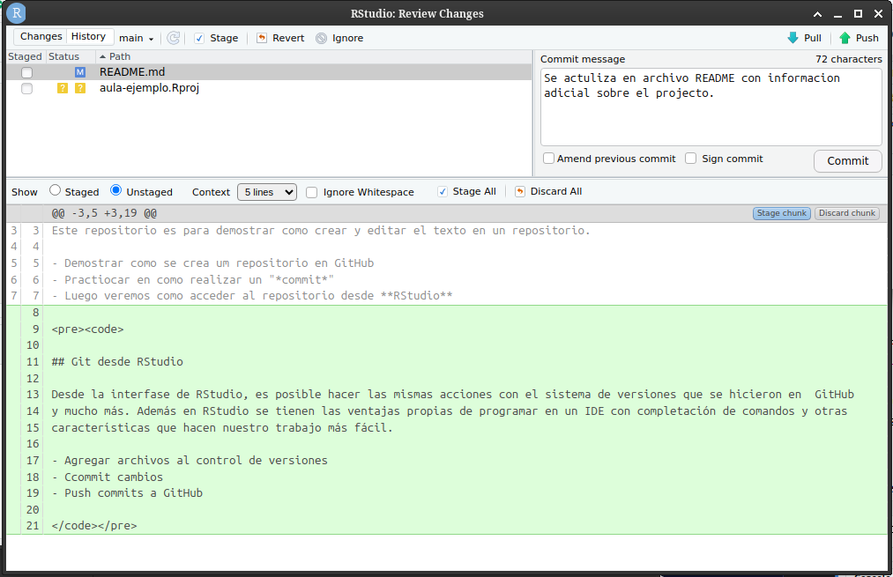
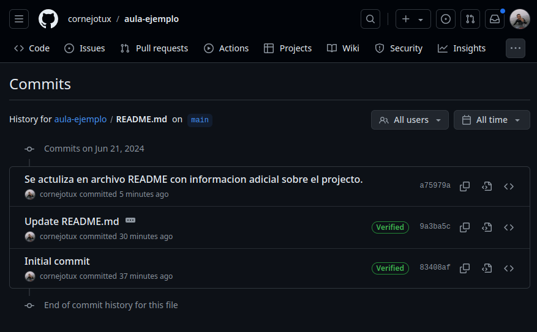

<p align="left">
<strong><a href="../Indice.md">Indice</a></strong>
|
<strong><a href="../Intro-a-R/R.md">R</a></strong>
|
<strong><a href="../Intro-a-Python/Python.md">Python</a></strong>
|
<strong><a href="../Intro-a-Jupyter/Jupyter.md">Jupyter</a></strong>
|
<strong><a href="../Intro-a-Markdown/Markdown.md">Markdown</a></strong>
|
<strong><a href="../Intro-a-github/Github.md">Github</a></strong>
|
<strong><a href="../enlaces.md">Enlaces</a></strong>
</p>

 

# Trabajando localmente con Git y GitHub en RStudio
**Autor:** Jorge Cornejo-Donoso


RStudio incluye soporte para Git como sistema de control de versiones,
pero esto **sólo** ocurre si estamos trabajando en un *Proyecto de
RStudio* (RStudio project folder). En esta sección vamos a clonar el
repositorio que se creó en GitHub y lo vamos a dejar un repositorio
local de un proyecto de RStudio.

Esto es lo que vamos a hacer:

1.  Crear un proyecto nuevo.
2.  Inspeccionar el panel Git y el historial de versiones.
3.  Confirmar una modificación (commit) al archivo README.md.
4.  Commit las modificaciones que hicieron en RStudio.
5.  Inspeccionar el historial de versiones.
6.  Crear y commit un archivo Rmd.
7.  Enviar (*Push*) estos cambios a GitHub.
8.  Ver el historial de cambios en GitHub.

Consulte el tutorial [Introducción a Git y GitHub](../Intro-a-github/Github.md) para acceder a una presentación más amplia a estas herramientas.

## Crear nuevo Proyecto (Create a New Project)

Comience creando un *New Project…* en RStudio, seleccione la opción
*Version Control* y pegue el URL de GitHub que copió en el espacio para
repositorio remoto (*Repository URL*). Si bien usted puede darle el
nombre que quiera al repositorio local, se usa típicamente el mismo
nombre que el que se tiene en GitHub, de esta forma se mantiene un grado
de correspondencia. Usted puede elegir cualquier directorio para su
copia local, en mi caso use el directorio `development`
(fig. @ref(fig:githubClone)).


<p class="caption">

Captura de pantalla para la creasción de un proyecto de RStudio clonando
un repositorio remoto.

</p>

Un vez que haga clic en `Create Project` (crear proyecto), una nueva
página de RStudio se abrirá con todos los archivos copiados localmente
desde el repositorio remoto. Dependiendo de como esté configurada la
versión de RStudio, la posición y tamaño de los paneles puede cambiar,
pero generalmente todos van a estar presentes, incluyendo los paneles
*Git* y el listado de archivos (*Files*) que fueron creados en el
repositorio remoto.


<p class="caption">

Captura de pantalla de la interfase del projecto de RStudio con el clon
local de repositorio.

</p>

En la figura @ref(fig:githubCloneLocal) puede ver que apareció un
archivo llamado `sasap-test.Rproj` y que están los otros 3 archivos que
se crearon con el repositorio remoto de GitHub (`.gitignore`, `LICENSE`
y `README.md`).

En el panel *Git* en RStudio se pueden ver 2 archivos. Este es el panel
de estatus donde se se muestran todos los archivos del repositorio en
los cuales se han realizado modificaciones. En este caso, el archivo
`.gitignore` se muestra con una *M* que significa *Modificado* y
`sasap-test.Rproj` con un *? ?* para indicar que este archivo no está
siendo monitoreado. Esto significa que git no tiene registro de ninguna
version para este archivo y que no sabe nada acerca de el. A medida que
usted vaya tomando decisiones sobre el control de versiones en RStudio,
estos iconos van a ir cambiando para reflejar el estatus de la versión
actual de cada uno de los archivos.

## Inspeccionar el historial (history)

A continuación vamos a hacer clic en el botón *History* (historial, es
el reloj que aparece en la primera fila al interior del panel ed Git),
esto despliega una ventana con el registro de los cambios que se han
realizado y, en este caso, deben ser idénticos a lo que usted vio en
GitHub. Al hacer clic en cada fila del historial, podrá ir viendo
exactamente que fue agregado y cambiado en cada uno de los commits en
este repositorio.


<p class="caption">

Historial de los cambios realizados en el repositorio local.

</p>

## Confirme cambios haciendo clic en *commit* al archivo README.md (Commit a README.md change)

Ahora hagamos algunos cambios al archivo README.md en RStudio. Agregue
una sección nueva con un block de *markdown* como este:

```{=html}
<pre><code>

## Git desde RStudio

Desde la interfase de RStudio, es posible hacer las mismas acciones con el sistema de versiones que se hicieron en  GitHub
y mucho más. Además en RStudio se tienen las ventajas propias de programar en un IDE con completación de comandos y otras
características que hacen nuestro trabajo más fácil.

- Agregar archivos al control de versiones
- Ccommit cambios
- Push commits a GitHub

</code></pre>
```
Una vez que los haya guardado, podrá ver en forma inmediata el archivo
*README.md* en el panel Git (fig. @ref(fig:rstudioPanelStatus)), marcado
con una **M** de modificación. Ahora usted puede seleccionar este
archivo en el panel de Git y hacer clic en *Diff* para ver los cambios
(comparando las diferencias) que guardó (note que estos cambios no se
han confirmado (*commit*) aun a su repositorio local).


<p class="caption">

Panel de estado de los cambios en los archivos.

</p>

En la figura @ref(fig:rstudioDiferencias) se muestra como se ven los
cambios comparados con el archivo original. La líneas nuevas se destacan
en color verde y en rojo las que fueron eliminadas.


<p class="caption">

Ventana que presenta las diferencias entre la versión almacenada en el
repositorio y los últimos cambios realizados.

</p>

## Commit los cambios hechos en Rstudio

Para confirmar los cambios que se acaban de hacer en el archivo
README.md, selecciones la caja de selección *Staged* a lado del nombre
del archivo, este le dice a Git cuales son los cambios que quiere sean
incluidos en el commit, escriba un mensaje describiendo que cambios se
hicieron y por qué y finalmente haga clic en boton *Commit*
(fig. @ref(fig:rstudioCommit1)).



<p class="caption">

Captura de pantalla con un mensaje describiendo la confirmación (commit)
que se realizará.

</p>

Note que algunos de los cambios en el repositorio, `.gitignore` y
`sasap-test.Rproj`, aun no se han confirmado y no serán parte del
*commit*. En otras palabras, aun existen cambios pendientes para ser
registrados en el repositorio. Usted vará una notificación que indica
(en inglés):

<code>Your branch is ahead of ‘origin/master’ by 1 commit.</code>

Lo que se traduce a: <code>\_Su rama esta más avanzadada que el
‘maestro/origen’ por una confirmación</code>

Esto significa que hemos commit **1** cambio en el repositorio local,
pero que este no se está en el repositorio de origen (`origin`), no se
ha hecho push, donde origen es el nombre que se usa típicamente para el
repositorio en GitHub. Entonces, confirmemos los cambios pendientes,
para esto seleccione la caja *staged* y luego escriba el mensaje
describiendo el commit (fig. @ref(fig:rstudioCommit2)).


<p class="caption">

Captura de pantalla con los archivos a confirmar sus cambios y el texto
descriptivo de la confirmación.

</p>

Cuando haya terminado no habrán mas cambios pendientes en el panel *Git*
y el repositorio estará completamente limpio.

## Inspeccionando el historial

Fíjese que ahora el mensaje dice:

<code>Your branch is ahead of ‘origin/master’ by 2 commits.</code>

<code>\_Su rama esta más avanzadada que el ‘maestro/origen’ por 2
confirmación</code>

Estas 2 confirmaciones son las dos que acabamos de hacer y no se han
empujado (push) aun a GitHub. Haciendo clic en el botón *History*
(historial), podemos ver que hay un total de 4 commit en el repositorio
local, mientras hay sólo 2 en GitHub (fig. @ref(fig:rstudioCommit3)).


<p class="caption">

Captura de pantalla con 4 commits.

</p>

## Enviar (Push) cambios a GitHub

Ahora que se han hecho todos los cambios deseados en el repositorio
local, usted puede empujar (*push*) los cambios a GitHub usando el botón
*Push*. Se abrirá una ventana donde se pregunta por su usuario y
password de GitHub, luego los cambios serán enviados. Esto dejará su
repositorio local en un estado totalmente limpio y sincronizado con el
repositorio remoto. Terminado esto, en el historial (en GitHub) se
muestran todos los commits, incluyendo los 2 que fueron hechos en GitHub
y los 2 que se hicieron en forma local con RStudio.


<p class="caption">

Captura de pantalla con los 4 modificaciones confirmadas.

</p>

Ahora puede ver que las etiquetas del repositorio local (`HEAD`) y del
remoto (`origin/HEAD`) están apuntando a la misma versión en el
historial. De esta forma, si miramos el historial de los commits en
GitHub serán iguales a los que tenemos en forma local.



<p class="caption">

Captura de pantalla con el historial de cambios en github.

</p>

## Sobre (buenos) mensajes de confirmación (commit)

Es claro que una buena documentación es crítica para hacer del historial
de versiones significativo y útil. Es tentador saltarse la escritura del
mensaje asociado al commit o escribir algo por defecto como
‘Actualización!’. Sin embargo es importante escribir mensajes que sean
para entender en el futuro que se hizo y por qué. Ademas, los mensajes
que se usan en commits son en general más fáciles de entender si usan
una convención de verbos activos. Por ejemplo, se puede ver que los
mensajes de commit en las capturas de pantallas comienzan siempre con un
verbo en pasado (en inglés!) y que explican que fue lo que se cambió.

Si bien muchos de los cambios que aquí se hicieron son simples y se
explican por si mismos, para cambios más complejos, es mejor entregar un
mensaje completo y auto-contenido. La convención, sin embargo, es tratar
de usar mensajes cortos, con una sentencia breve, seguido de una
explicación más detallada y racional para el cambio. Esto permite que el
nivel de detalles sea legible en el registro de las versiones (version
log). No puedo contar el número de veces que he visto los registro d e
commits de hace 2, 3 o 10 años y agradecido el nivel de diligencia de
los colaboradores que se tomaron el tiempo de describir el trabajo que
se realizó.

## Flujos de trabajo colaborativos y libres de conflictos (relacionados con Git)

Hasta ahora nos hemos enfocado al uso de Git y GitHub para el uso
personal, como ya se demostró esto es extremadamente útil. Sin embargo
donde git y GitHua brilla es cuando se comparte un repositorio GitHub
con colaboradores, de esta forma se pede trabajar en un código, análisis
y modelos en forma colaborativa. Cuando se trabaja de esta manera con
otros investigadores, es muy importante poner atención al estado del
repositorio remoto para evitar potenciales conflictos al combinar el
trabajo. Un *merge conflict* ocurre cuando dos colaboradores hacen 2
commits en forma separada donde se ha(n) cambiado(s) la(s) misma(s)
línea(s) de código de un archivo. Cuando esto ocurre, git no puede
combinar los cambios en forma automática y arroja un error preguntando
como resolver el conflicto. Esto no es grave, no es necesario tenerle
miedo a los *merge conflicts* ya que son muy fáciles resolver y aquí hay
algunas
[guías](https://help.github.com/articles/resolving-a-merge-conflict-using-the-command-line/)
[geniales](https://stackoverflow.com/questions/161813/how-to-resolve-merge-conflicts-in-git).
de como hacerlo (por ahora sólo en inglés).

Dicho esto, es siempre mejor evadir este tipo de conflictos, lo que se
pueden minimizar siguiendo las siguientes sugerencias:

-   Asegúrese de traer (*pull down*) todos los cambios antes de
    confirmarlos (commit).
    -   Asegurese que tiene los cambios más recientes.
    -   Pero puede ser que necesite arreglar su código si ocurren
        conflictos.
-   Coordínese con con sus colaboradores con quien va a trabajar.
    -   Usted **tiene** que comunicarse para colaborar.

## Actividad

Use RStudio para agregar un nuevo archivo al repositorio `sasap-test`,
desarrolle una estructura básica y guárdela.

A continuación *stage* y *commit* el archivo en forma local y luego
*push it* a GitHub.
