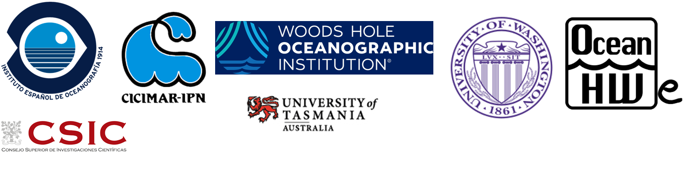

# Aula-invertida
## Introducción al uso de software de código abierto aplicado al análisis de datos oceanográficos y gestión pesquera

**Marian Peña, Héctor Villalobos, Alma Carolina Castillo Trujillo, Denisse Fierro Arcos, Emilio Mayorga**

[INICIO](Indice.md)

<a style="text-align: center;font-size: 500" href="Indice.md">INICIO</a>

 

